Discord has the capabilities to display **colored text** through **code blocks** and **syntax highlighting**. The library discord uses for _highlighting_ is **[highlight.js](https://github.com/highlightjs/highlight.js)**. Code blocks also supports **ANSI** which offers a more controllable _coloring experience_.

:::warning
Features discussed in this page **aren’t** currently **supported** on **mobile**!
:::

### Ansi
---
Discord offers support for **ANSI** colored text through code blocks. To get started you need to copy the **escape unicode character** used (`\u001b`). To copy the raw character use the copy button below.

```none

```

Now that you know how to copy the escape character, Let’s go over how the **ANSI** is **structured**. To be able to send colored messages you need to use the **ANSI** language on a **code block**. After that, you need to make sure to use the correct **format** as a _prefix_ before your text. `\u001b[{format code};{ansi code};{ansi code}m`. We will go over the codes later on. To **reset** to **default** use the `\u001b[0m` prefix.

Example message with the `\u001b` character unescaped.
````none
```ansi
Red text with blue background.
```
````

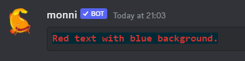
#### ANSI Codes
---
Codes are split into 3 different categories. **Format**, _text colors_*, and **background colors**. You can set them in any order and set as many of them as you want. The **last code** will **overwrite** the ones before it.

##### Formats
---
- `0`. Default
- `1`. **Bold**
- `4`. Underline

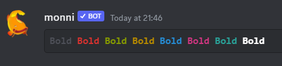

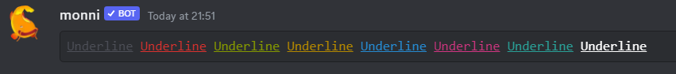

##### Text Colors
---
- `30`. Gray
- `31`. Red
- `32`. Green
- `33`. Yellow
- `34`. Blue
- `35`. Pink
- `36`. Cyan
- `37`. White

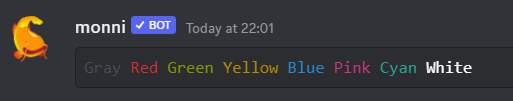

##### Backgrounds
---
- `40`. Firefly dark blue
- `41`. Orange
- `42`. Marble blue
- `43`. Greyish turquoise
- `44`. Gray
- `45`. Indigo
- `46`. Light gray
- `47`. White

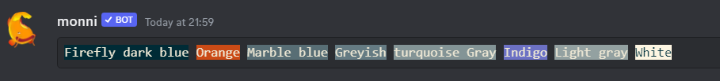

### Syntax Highlighting
---
There is over **100** supported [languages](https://discord-syntax-highlighting.vercel.app/) and only **a few of them** are **showcased**. In the **code blocks** you can specify _language_ after three backticks ` ```language here``` `.

:::note
**The Code blocks** on this page use a different **color scheme**. They are _provided for ease of copying_ and _testing different examples_.
:::
#### Bash
---
`bash`, `sh`

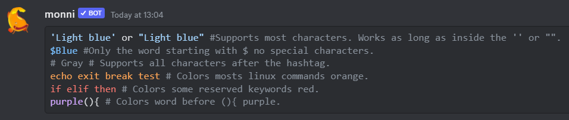

```bash
'Light blue' or "Light blue" #Supports most characters. Works as long as it's inside either '' or "".
$Blue #Only the word starting with $. No special characters.
# Gray # Supports all characters after the hashtag.
echo exit break test # Colors most linux commands orange.
if elif then # Colors some reserved keywords red.
purple(){ # Colors words before (){ purple.
```


#### Diff
---
`diff`, `patch`

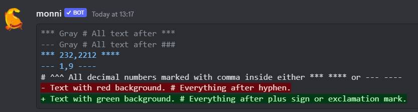

```diff
*** Gray # All text after ***
--- Gray # All text after ###
*** 232,2212 ****
--- 1,9 ----
# ^^^ All decimal numbers marked with a comma inside either *** **** or --- ----
- Text with red background. # Everything after a hyphen.
+ Text with green background. # Everything after a plus sign or exclamation mark.
```

#### Toml
---
`toml`, `ini`

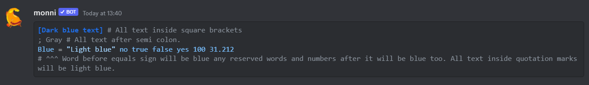

```toml
[Dark blue text] # All text inside square brackets
; Gray # All text after a semi colon.
Blue = "Light blue" no true false yes 100 31.212
# ^^^ Word before equals sign will be blue any reserved words and numbers after it will be blue too. All text inside quotation marks will be light blue.
```

#### Json
---
`json`

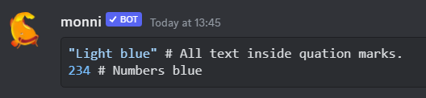

```json
"Light blue" # All text inside quotation marks.
234 # Numbers blue
```

#### Fix
---
`fix`

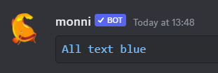

```fix
All text blue
```

#### Markdown
---
`markdown`, `md`, `mkdown`, `mkd`

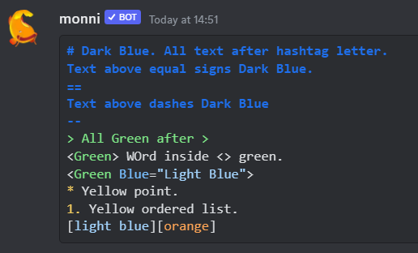

```md
# Dark Blue. All text after hashtag letter.
Text above equal signs are Dark Blue.
==
Text above dashes are Dark Blue
--
> All Green after >
<Green> Words inside <> green.
<Green Blue="Light Blue">
* Yellow point.
1. Yellow ordered list.
[light blue][orange]
```

#### YAML
---
`yaml`, `yml`

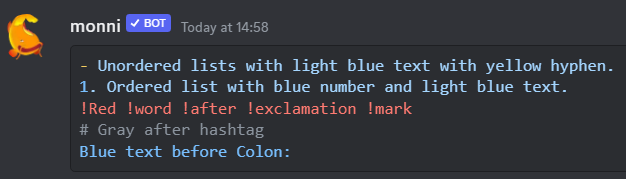

```yaml
- Unordered lists with light blue text and yellow hyphen.
1. Ordered list with a blue number and light blue text.
!Red !word !after !exclamation !mark
# Gray after hashtag
Blue text before a Colon:
```

#### SML (Standard ML)
---
`sml`, `ml`

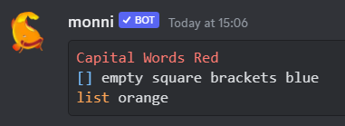

```sml
Capital Words Red
[] empty square brackets blue
list orange
```

#### Prolog
---
`prolog`

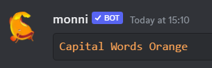

```prolog
Capital Words Orange
```

***
### Useful Resources
---

:::info
Need help or have suggestions? Join our [support server](https://discord.gg/E8nYdQfqA3).
:::

List and demo of all supported languages.

- [https://discord-syntax-highlighting.vercel.app/](https://discord-syntax-highlighting.vercel.app/)

Great gist on ansi coloring.

- [https://gist.github.com/kkrypt0nn/a02506f3712ff2d1c8ca7c9e0aed7c06](https://gist.github.com/kkrypt0nn/a02506f3712ff2d1c8ca7c9e0aed7c06)

Markdown guide with syntax highlighting examples.

- [https://gist.github.com/kkrypt0nn/a02506f3712ff2d1c8ca7c9e0aed7c06](https://gist.github.com/kkrypt0nn/a02506f3712ff2d1c8ca7c9e0aed7c06)

Discord ansi color editor.

- [https://rebane2001.com/discord-colored-text-generator/](https://rebane2001.com/discord-colored-text-generator/)
