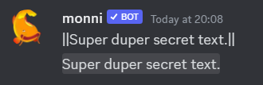

Discord has a built in **markdown engine**. Features of this engine range from typical markdown such as **bold** and _italics_ to timestamps and code blocks.

### Text Formatting
---
| Input | Result |
|----------|----------|
| *Italics*| \*Italics\* or \_Italics\_|
| **Bold** | \*\*Bold\*\* |
| ***Bold italics*** | \*\*\*Bold italics\*\*\* |
| <u>Underline</u> | \_\_Underline\_\_ |
| ~~Strikethrough~~ | \~\~Strikethrough\~\~ |

Different text **formattings** can be **combined**. For example you can combine <u>*underline and italics*</u> with  
`*__underline and italics__*`.


### Headers
---
Discord supports usage of **headers**. Headers start with a **hashtag** followed by a **space** and then the text itself `# Text here`. There is three different **sizes of headers**. The largest is `#`, then `##`, and the smallest is `###`. A message has to start with a header, so a _header in the middle of a sentence_ isn’t possible.


:::note
Did you know that text formatting works in headers?
:::

### Lists
---
Discord supports **lists** in their markdown. You can **create** a list by using `*` or `-` before each line. **Indentation** can be achieved by having space before `*` or `-`.


#### Ordered Lists
---
There is also support for **ordered lists**. to use them add a _number followed by period_. These numbers don’t have to be in numerical order but the list will start with smallest number. You can **indent** your list by adding a **space** before the number.

```none
1. First thing in the list.
2. Second thing in the list.
 1. Sublist
  1. second sublist thing
   * Third sublist thing
```


### Timestamps
---
Discord has support for **timestamps**. They allow you to specify **dates** or **times** in a way where its _translated_ and automatically shown in the correct _timezones_. [Unix](https://en.wikipedia.org/wiki/Unix_time) time is a way to keep track of time in seconds from the unix Epoch of **january 1st, 1970 UTC**. They are good for saving dates without the “worry” of [timezones](https://www.youtube.com/watch?v=rksaoaqt3JA).

**The format of timestamps:** `<t:unix time:style>`. In the examples following, unix timestamp `1653043103` is used with timezone being **utc+3 EEST**.

| Style           | letter | Input                | 12h                          | 24h                       |
| --------------- | ------ | -------------------- | ---------------------------- | ------------------------- |
| Default         | None   | ``<t:1653043103>``   | May 20, 2022 1:38 PM         | 20 May 2022 13:38         |
| Short time      | t      | ``<t:1653043103:t>`` | 1:38 PM                      | 13:38                     |
| Long time       | T      | ``<t:1653043103:T>`` | 1:38:23 PM                   | 13:38:23                  |
| Short date      | d      | ``<t:1653043103:d>`` | 05/20/2022                   | 20/05/2022                |
| Long date       | D      | ``<t:1653043103:D>`` | May 20, 2022                 | 20 May 2022               |
| Short date/Time | f      | ``<t:1653043103:f>`` | May 20, 2022 1:38 PM         | 20 May 2022 13:38         |
| Long date/time  | F      | ``<t:1653043103:F>`` | Friday, May 20, 2022 1:38 PM | Friday, 20 May 2022 13:38 |
| Relative        | R      | ``<t:1653043103:R>`` | a year ago                   | a year ago                |

:::info
Format of the timestamp (12h or 24h) changes according to your language settings.
:::


### Mentions
---

| Type           | Structure              | Example                    | Result                                             |
| -------------- | ---------------------- | -------------------------- | -------------------------------------------------- |
| User           | ``<@user_id>``         | ``<@911945727402471455>``  |                      |
| Channel        | ``<#Channel_id>``      | ``<@911945727402471455>``  |                |
| Role           | ``<@&role_id>``        | ``<@&961921133479878720>`` |                      |
| Slash Command  | ``</name:command_id>`` | ``</pet:107907537956>``    |                    |
| Emoji          | ``:emoji name:``       | ``:smile:``                |                    |
| Custom emoji   | ``<:name:id>``         | ``<:o:10072062957298>``    |      |
| Animated emoji | ``<a:name:id>``        | ``<a:s:100720629576>``     |  |

### Code Blocks
---
You can create _single_ line **code blocks** by wrapping your text in **backticks** `` ` ``.

\`Look at this nice code block.\`

`Look at this nice code block.`


#### Multiline
---
**Multiline code blocks** can be used to create code blocks which span **many lines**. They also support **syntax highlighting**. You can **create** multi line code blocks by enclosing text with ` ``` `. Syntax highlighting can be added by specifying language after three backticks `` ` ``. **More information** can be found [here](https://monni-docs-f7dj.onrender.com/blog/colored-text#syntax-highlighting).

````none
```python
print("Hello, I am inside a codeblock.")
```
````


:::info
Multiline code blocks are the **de facto** way to create **colored text** in discord. If you want to know more [check out our in-depth guide on them](https://monni-docs-f7dj.onrender.com/blog/colored-text).
:::

### Block Quotes
---
Block quotes allow you to **indent** part of your text. You can make **one line** of text indented by adding `>` before the line. You can make **multiple lines** indented by adding `>>>` before the lines.


### Spoilers
---
Spoilers can be used to make **part** of or the **whole** message **hidden** by a black box which disappears locally once a person clicks it. You can **create** spoilers by enclosing your text in two vertical bars `||`.




### Masked Links
---
You can **create** masked links by enclosing the **masked link text** in `[]` and then **without** a space _link_ inside **brackets** `()`.

`Visit [monni website today](https://monni.fyi/).`

Visit [**Monni website today**](https://monni.fyi/).

:::info
Need help or have suggestions? Join our [**support server**](https://discord.gg/E8nYdQfqA3).
:::

### Useful Resources
---
Discord help article on markdown

- [https://support.discord.com/hc/en-us/articles/210298617-Markdown-Text-101-Chat-Formatting-Bold-Italic-Underline-](https://support.discord.com/hc/en-us/articles/210298617-Markdown-Text-101-Chat-Formatting-Bold-Italic-Underline-)

Third party discord timestamp tool

- [https://r.3v.fi/discord-timestamps/](https://r.3v.fi/discord-timestamps/)

Discord documentation section outlining timestamps.

- [https://discord.com/developers/docs/reference#message-formatting-timestamp-styles](https://discord.com/developers/docs/reference#message-formatting-timestamp-styles)

Gist on how timestamps work

- [https://gist.github.com/LeviSnoot/d9147767abeef2f770e9ddcd91eb85aa](https://gist.github.com/LeviSnoot/d9147767abeef2f770e9ddcd91eb85aa)

Discord help article on spoilers

- [https://support.discord.com/hc/en-us/articles/360022320632-Spoiler-Tags-](https://support.discord.com/hc/en-us/articles/360022320632-Spoiler-Tags-)

Discord documentation section outlining mentions

- [https://discord.com/developers/docs/reference#message-formatting-formats](https://discord.com/developers/docs/reference#message-formatting-formats)

Third party library discord uses for syntax highligting

- [https://github.com/highlightjs/highlight.js](https://github.com/highlightjs/highlight.js)