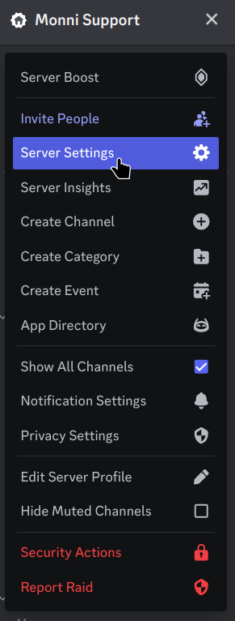
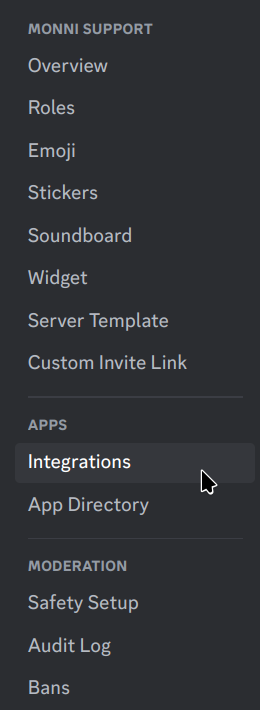
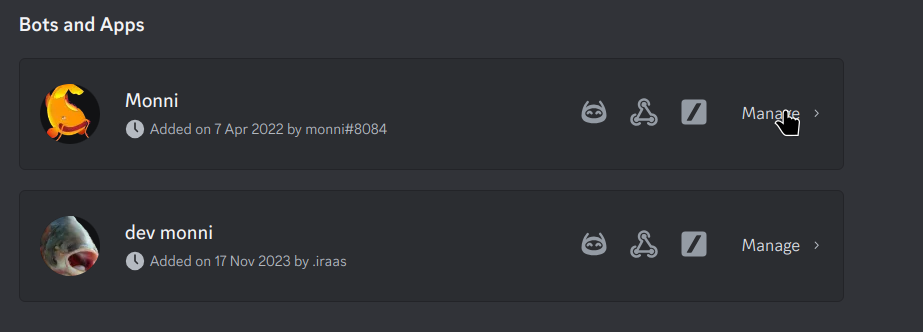
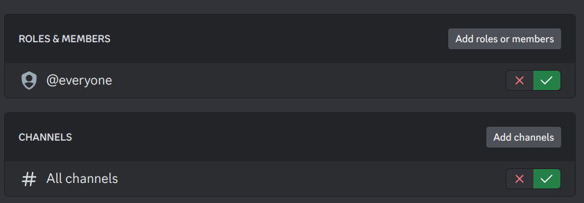
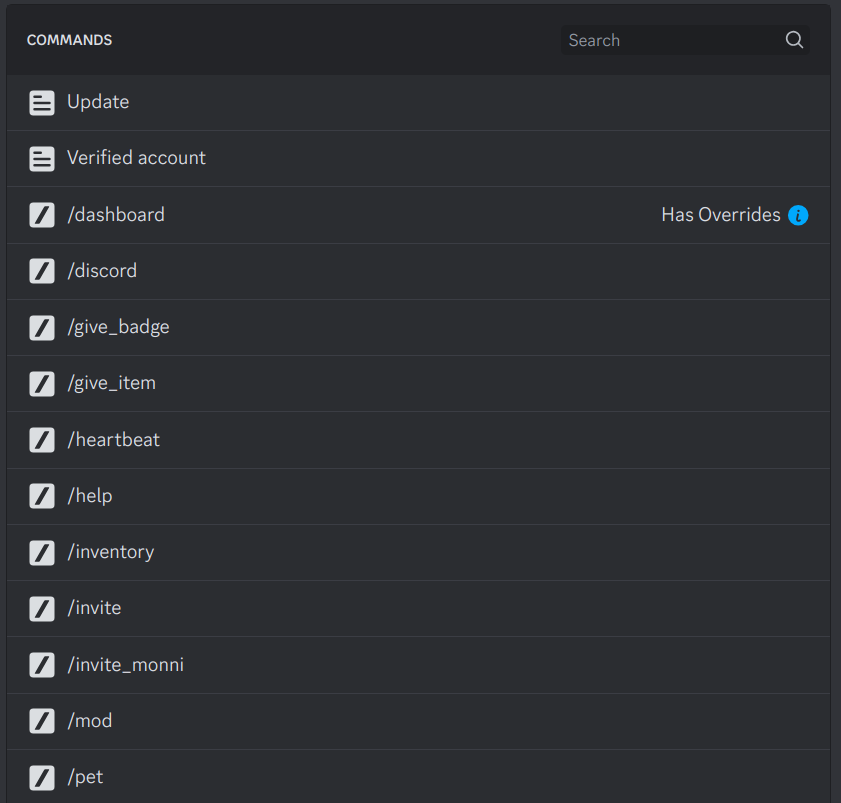
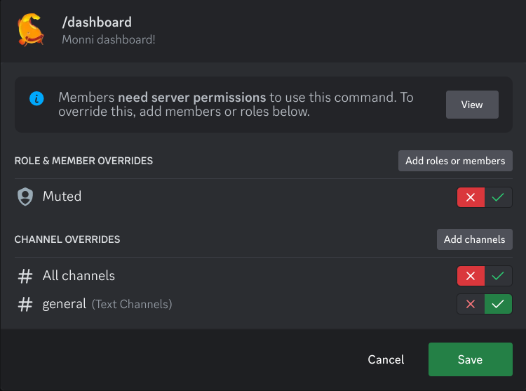

Discord has a built-in support for changing who and where slash commands and context menus can be used.

:::warning
In order to change permissions of commands you need to be an administrator of the server!
:::

:::danger
Changing these settings isn't supported in the mobile versions of discord.
:::

## Changing permissions
To get started head to server settings.

Then scroll down to integrations

From integrations find `Bots and Apps` then select Manage on Monni
Once manage has been opened its possible to change command permissions single command at a time or globally.

:::info
These limits don't apply to members with the administrator permission.
:::

### Global overwrites

Roles and members dictates who can use the commands. By default, everyone can use the bots commands which require no permissions. Global settings don't overwrite the required permissions, but they dictate which people are given chance to qualify for using the command.

Channels dictates which channels the commands can be used in. By default, any command can be used in any channel, but you can change this to for example limit command usage to only commands channel.

### Single command overwrites

:::info
Command with overwrite

:::

Single command overwrites differ from global ones as they can be used to overwrite default Monni command permissions. This can be dangerous so **ensure you don't make dangerous commands usable by everyone.** Single command overrides take precedent over global overrides.

Example of a potential overwrite
In the above overwrite the role muted has the ability to use the /dashboard command removed. The command is also disabled in every other channel than general.

:::danger
Role & Member takes precedent over default Monni permissions. Ensure you are changing the intended command and overrides are correct.
:::
