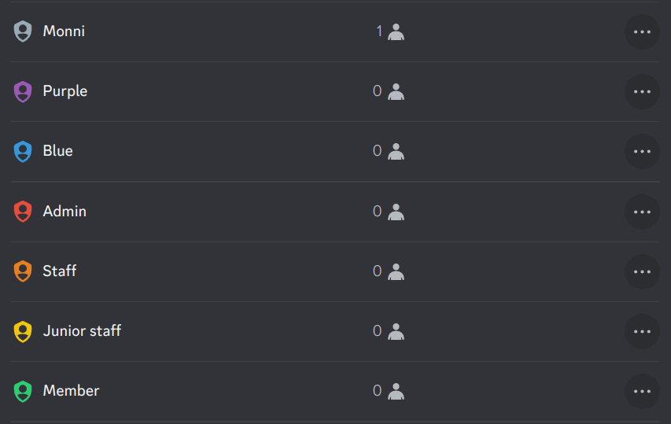
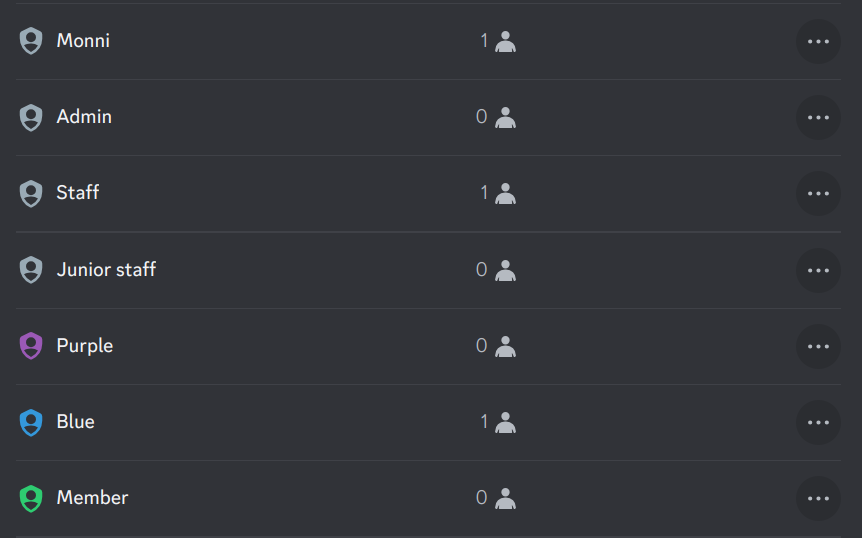

# Role hierarchy and permissions

Discord uses a hierarchy based permissions system for guild management. This is a very powerful system, but the ability for hierarchies to overlap and overwrite each other creates a very complex and at times, difficult to understand system. In the hierarchy position of role matters. For example, kicking, banning, or changing roles cannot be done on a person higher than you in the hierarchy.

:::warning
Administrators can bypass every other hierarchy permission unless affecting people higher in the hierarchy.
:::

## Common pitfalls
Before we look at how the role hierarchy works in detail, lets go over a few common issues with the role hierarchy system.

<!-- truncate -->
### Colour only roles
Many guilds have roles only for the purpose of providing a certain colour of a members username. This is fine, but due to the nature of the inheritance of permissions it can have unwanted consequences. Let's look at the following example of a role.

The issue isn't obvious, but the inheritance of permissions and how the highest person is determined causes issues here. Let's assume a person called smith has the `junior staff` role and wants a purple name, so they are given the `Purple` role. The purple role inherits all the permissions of junior staff, in this case time out and kick. Smith now has the ability to kick or timeout any admin or staff who lack purple role. This is due to the purple role being higher in the hierarchy than staff or admin, and inheriting the permissions of junior staff. One way to fix this is to sacrifice the role colours of admin, staff and junior staff.

Now even if Smith has the purple role he can't kick people above him in the hierarchy. The only issue is that the colour of the staff role was lost. This works due to the colour logic being based on the highest role with a colour.

## Role permissions
The highest level of the permission system. Each role can have its own set of permissions and then these roles can be used later to set the channel level exceptions. Roles are based on a hierarchy system where each role is in some spot in the hierarchy.

### What is @everyone in role permissions?
The @Everyone role like the name states, gives the perms selected to any role in the server. So if you wanted everyone to be able to change nicknames you could make it possible for everyone through the `@everyone` role.
## Hierarchy based permission
Some permissions, like kicking, depend heavily on the hierarchy to determine who can kick who. You can only do actions like kick on people which are lower than you in the hierarchy. People who are at the same level or higher are immune. Actions which follow these rules include:
- Nickname change.
- Kick.
- Ban.
- Timeout.
- Mute and deafen.
- Role giving and removal.

:::info
The Server owner is always considered the highest person in hierarchy.
:::
## Permission inheritance
In the role hierarchy the users highest role in the hierarchy inherits all of the permissions. A simple example would be a permission giving a moderator role with permissions being inherited by a visual moderator role like “Senior staff”. In this case “Senior staff” would get all the permissions of the lower roles, including moderation perms. This is good but has the effect of person potentially having a higher hierarchy position than expected.

:::info
Role colour and icon are determined from the highest roles which have these.
:::

## Channel and category permissions
Channels and categories can have their own permissions. These overwrite the permissions of roles. Let's start with what different permission options mean.

`X` Means that a permission is disabled from a role/user

`/` Means default permissions. On the `@everyone` role this means using the permissions of the roles the person has. In every other case it will use the permission set on `@everyone`.

The Check mark means the permission is enabled on a role/user
### What is @everyone in channel permissions?
`@everyone` functions as the default template for permissions. It's the only permission excluding server wide roles which you can overwrite in every other case, if the role enables the permission. it cannot be disabled with any other role regardless of hierarchy. This is the reason mute roles don't work well on private channels. Let's say you want to disable the sending of messages for everyone but staff, you could disable the send messages permission with everyone and overwrite the staff role to have access to sending messages.

:::info
Administrator permissions can't be overwritten through channel/category permissions.
:::

### Category permissions
Category permissions work the same way as the channel ones but are only applied to channels which are synced with the category. When a channel is synced it inherits all the permissions of the category. Changes in category permissions automatically apply to all synced channels.

## Useful resources
https://support.discord.com/hc/en-us/articles/206029707-Setting-Up-Permissions-FAQ
https://support.discord.com/hc/en-us/articles/214836687-Role-Management-101
https://support.discord.com/hc/en-us/articles/10543994968087-Channel-Permissions-Settings-101