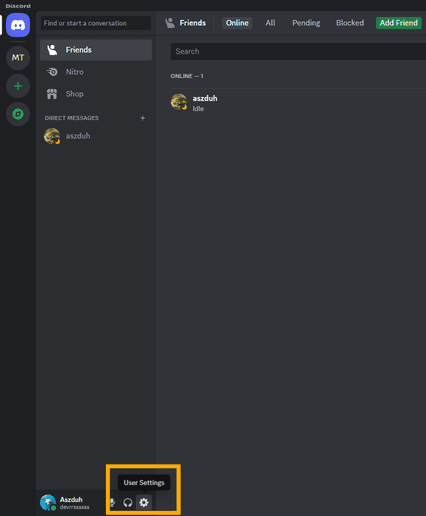
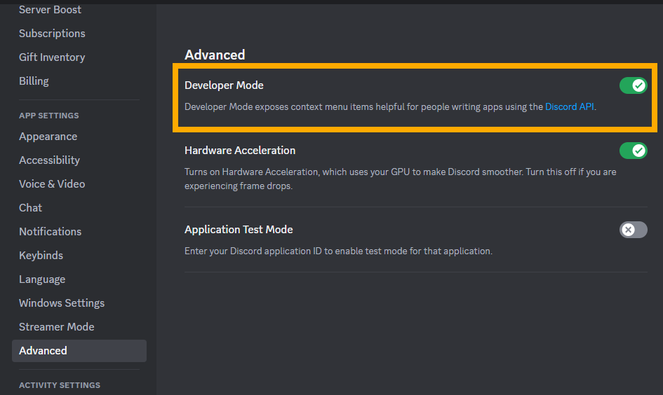
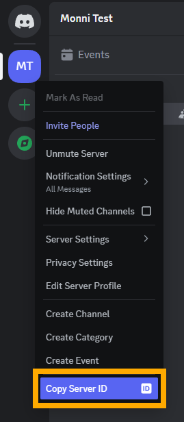
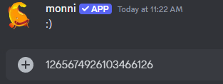

When troubleshooting problems it can be useful to know what server a problem is occurring in. One way to quickly locate a server is using the unique Guild ID given to each individual server.

## Finding a Guild ID
---

Locating the Guild ID first requires turning on Discord's *Developer Mode* which enables options in menus that are primarily used to aid in working with the Discord API.

:::note
If *Developer Mode* has already been enabled then skip to step 3.
:::

---

**Step 1. Open "*User Settings*":**

**Step 2. Go to "*Advanced Settings*" and enable "*Developer Mode*":**

**Step 3. Locate the Guild you need the ID of and right click it, then click "*Copy Server ID*":**

:::info
No permissions are needed to be able to copy a Guild ID.
:::

**Step 4. With the Guild ID copied, you can now paste it wherever necessary with Ctrl+V:**

---

:::info
Need help or have suggestions? Join our [support server](https://discord.gg/E8nYdQfqA3).
:::