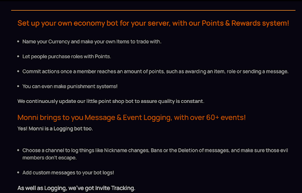
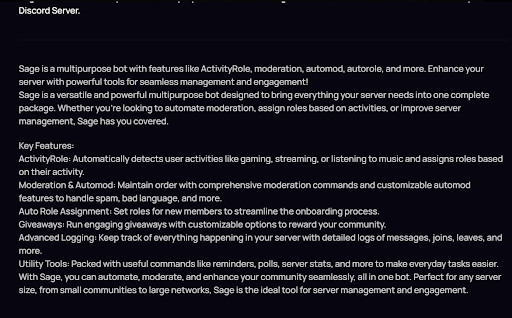

# Growing your discord server

So you’ve made a server and everything looks good, but you’ve still got an issue. 
It’s lonely here…

Luckily, you’ve stumbled upon this guide, so relax! I’ve compiled what I’ve learned to make it quick and easy for you to get rolling.

*Note: It’s not as hard as you think once you know what to do!*

## Advertisement Platforms

These are usually the first things that come to mind when trying to expand your server. Platforms like Disboard are people’s go to’s. 

However, there are necessary steps to take before this can be effective. If you neglect these, you won’t see much growth, if any at all!

<!-- truncate -->

So before we go over the practices of advertising on these platforms, you’ll need to know which ones to use. Platforms like Disboard come ranked. Meaning some are more visited and known about than others. Don’t disregard the lower ranked ones!

Here are some examples which you can also use:

1. Discords Discovery (Of course)
    
2. DISBOARD.ORG
    
3. DISCORD.ME
    
4. DISCORDBOTLIST.COM
    
A lot more are out there, so look around. Don’t neglect your google searches.

The only real difference you will see from these is the amount of traffic, capping paid advertising. With the right seo, you may experience higher traffic despite the platform, so even the lower ranked platforms are great places to be. It’s the beauty of having your own page.

### Advertising Practices

When you advertise, the most important thing is to stick to the topic.
Remember, you are technically selling to people. 

Let’s assume you run a minecraft roleplay server. The only people interested in joining are minecraft roleplayers. So when you advertise it should look like this:

- Tons of roles to take inside the mc server! (List of some roles)
    
- Friendly active community!
    
- Weekly events! (such as: etc etc)
    
- Other things you can do that they’d like.

And not

- Very fun server with a nice community.
    
- Roleplaying.
    
- Events.
    
- Other things without descriptions.
    
Your goal is to convince the person to join. You do this by being specific about what you offer. Focus on your target audience. Don’t say “MC roleplaying”. Mention the types of roleplaying possible. 

#### Keep it short

It’s annoying, but people won’t read text walls. Let’s compare two examples.

This is good. Easy to skim and pick up the value.
You could benefit from larger text too.

  
  
  
  
  
  
  
  
  
  

This is bad. It’s hard to read and a text wall. Avoid this!

Though despite the format, they are on point with the “be specific” part.

#### Add basic SEO

The first few lines of your advertisement will boost you on search results. You can use google to search things or use a tool to find what your target audience typically searches.

For the minecraft roleplay server, you’d probably want to mention “Minecraft” and “Roleplay” in the top. Using less popular but more hidden key words can actually give you higher traffic due to less competition in the search results.

People overthink the value of this so don’t stress too much, but it is definitely a huge help.

Just remember if you are on multiple platforms you probably don’t want to overlap your seo terms. Focus on different things based on priority. I would personally put higher searched terms on the more popular platforms.

#### Add something so they remember you.

The long game is effective too. Not everyone will join straight away, but if they are truly interested, they’ll eventually pursue what meets their needs. You want them to think of your server when this time comes. You do that by having a catchy hook or slogan for example. 

#### Sprinkle of mystery or fomo.

FOMO = Fear of missing out.

This is more minor than the rest, but if you have something like “limited event offering x”,

or you talk about something extremely interesting but don’t offer all the details unless they join, these things have been proven to peak the interest of individuals.
Not mandatory, but a nice cherry on top.

## Affiliation Schemes

Affiliation schemes can be super effective. This is essentially a little deal you do with another server where they publicly announce and then furthermore permanently display a permanent link to your server in preferably, an obvious location. You do the same on your server. This is usually done in affiliate channels. 

From this you gain an initial boost in growth, and then constant passive growth as long as your affiliate is consistently growing their server as well. It’s beneficial for both parties and a great way to grow your server. 

You should aim to get as many affiliates as possible, and there is no reason not to contact people for affiliations!

### Your targets

When looking to affiliate Discord servers, your targets should be servers that have members likely to share an interest with what you are offering. That doesn’t mean direct competition though, as this can actually be detrimental to you. 

If I host a minecraft building competition server, I know people in a minecraft rp community or something similar will probably be interested! But I likely won’t reach out directly to ANOTHER minecraft building competition server, unless I wanted to directly collaborate with them.

### How to contact these?

The two main ways to go about this is firstly to search for servers on google and join them. This works like a charm but you might need to brush up on your sales a bit! 

The second way is to ask people to refer you to the types of communities you are looking for. Once you are in one, it’s easier to find more!

You can contact somebody high up or the server owner then to talk about affiliation. 

### Out of Discord Affiliates

There is no need to keep affiliating just in Discord. You can affiliate with Youtubers, reddit communities, or anything you think can help you grow. 

## Social Media influence.

Social media can be used to advertise your Discord Server. You should choose platforms that your audience is most likely to be on. Are you a gaming server? Youtube shorts and such can be great.
If you’re offering some type of work maybe linked in.

## Referral Schemes

Put simply, a “Referral scheme” just means convincing your members to advertise for you. When somebody tells another person about your server we call that a “referral”. So a “Referral scheme” is a scheme to farm referrals.

You can convince people to invite other people by rewarding people for inviting. For example maybe you offer a role with benefits, or some in-game currency, or maybe you even pay people for it. It can definitely be done without real money though!

I use referral schemes and affiliation schemes A LOT as they help each other out, as you can extend your referral scheme to your affiliate servers!

## Recruiting

This is something I did when I ran a more serious server. But essentially this is the online version of door to door selling. Grab a few members from your server, preferably some high ranks like staff. Train them to recruit for you.

You can give them an advertising template or a general script, and send them to places where your target audience is. They’ll then talk to people and get them to join your server by showing how appealing it is. 

With this strategy if done incorrectly you might get some backlash. People can get bothered if they see the same message twice, or if they get a whiff of a salesman. Though rejections suck, they are a natural part of a growth process, so don’t let that stop you! Recruiting is SUPER effective. I’ve personally gained hundreds of members using this on just the small scale (:

### Closure
That's all, I hope this guide helped! If you have any ideas you'd think would help other people, feel free to contact me directly on Discord (My username is Rockoyhead) from the [Monni Support server](https://discord.gg/QDKcs3sFpw)

If it's useful I'll add it. Good luck!
