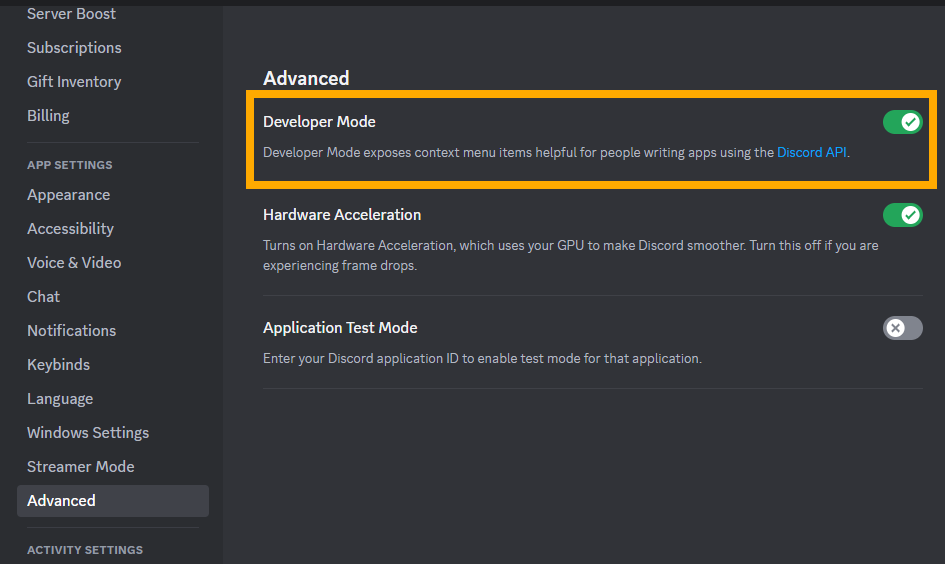
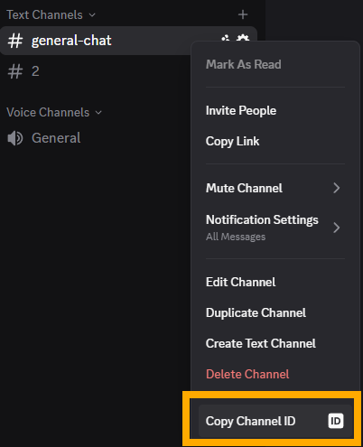
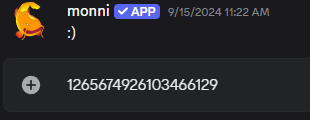

Sometimes you may need to use the ID of a Discord channel to interact with Discord's API to, for instance, send messages through a bot or integration to a specific channel. With this guide, you can find the ID needed to perform these or any other actions you may need!

## Finding a Channel ID
---

Locating the channel ID first requires turning on Discord's *Developer Mode* which enables options in menus that are primarily used to aid in working with the Discord API.

<!-- truncate -->

:::note
If *Developer Mode* has already been enabled then skip to step 3.
:::

---

**Step 1. Open "*User Settings*":**

**Step 2. Go to "*Advanced Settings*" and enable "*Developer Mode*":**

**Step 3. Locate the channel you need the ID of and right click it, then click "*Copy Channel ID*":**

:::info
No permissions are needed to be able to copy a channel ID.
:::

**Step 4. With the channel ID copied, you can now paste it wherever necessary with Ctrl+V:**

---

:::info
Need help or have suggestions? Join our [support server](https://discord.gg/E8nYdQfqA3).
:::