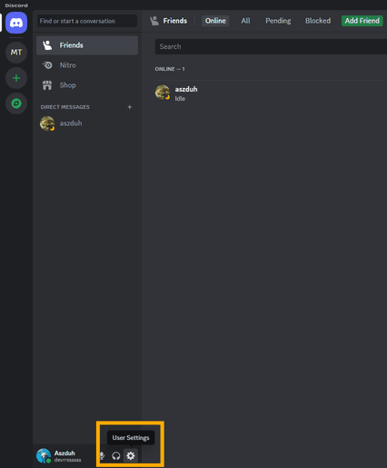
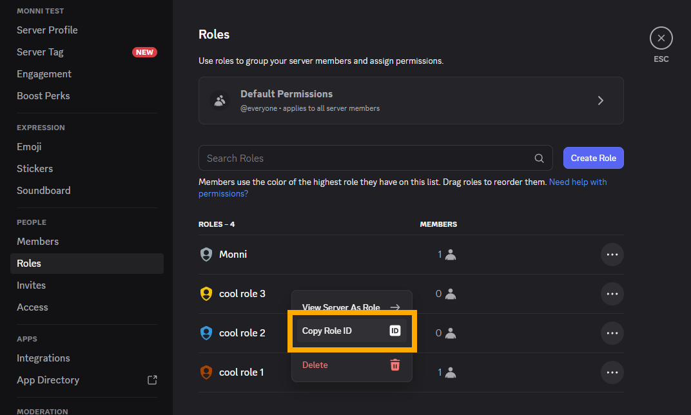
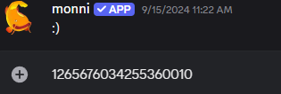

Using a role ID, you can do a few different things that may be necessary for a bot or integration to properly function, like interacting with Discord's API to assign certain roles to members. This guide will take you through the steps to quickly find a role ID!

## Finding a Role ID
---

Locating the role ID first requires turning on Discord's *Developer Mode* which enables options in menus that are primarily used to aid in working with the Discord API.

<!-- truncate -->

:::note
If *Developer Mode* has already been enabled then skip to step 3.
:::

---

**Step 1. Open "*User Settings*":**

**Step 2. Go to "*Advanced Settings*" and enable "*Developer Mode*":**

**Step 3. Locate the role you need the ID of (either by clicking on a user with the role or by going into the Role Menu in the server's settings) and right click it, then click "*Copy Role ID*":**

:::info
No permissions are needed to be able to copy a role ID from someone with the role, but some permissions are needed to enter the server's settings menu.
:::

**Step 4. With the role ID copied, you can now paste it wherever necessary with Ctrl+V:**

---

:::info
Need help or have suggestions? Join our [support server](https://discord.gg/E8nYdQfqA3).
:::