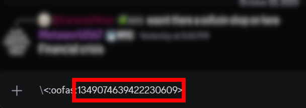

# How to get Custom Emoji IDs.
Getting an Emoji ID is actually very easy, and useful to know how to do. ID's can only be gotten from custom made emojis. 

1. Start by heading to the the discord guild with the emoji's that you'd like to get the ID of. Now find a channel where you can chat. 

2. Type into the chat the backslash " \ " character. 

3. Now, just type the custom emoji you'd like right after it. The ID will appear to the rightmost part of your message. 

You now have your Emoji ID! Use for all your niceties. 

<!-- truncate -->