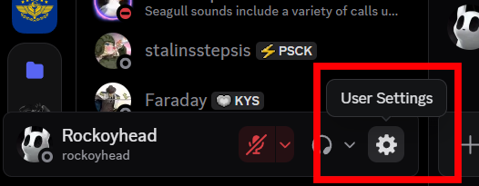
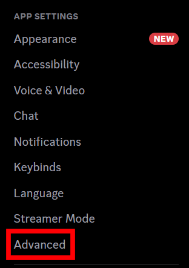
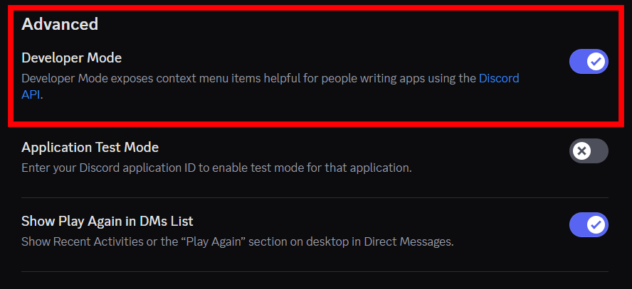

# Enabling Discord Developer Mode

There are many useful things that require enabling developer mode. One common one is the ability to get server IDs.

1. To begin, head over to your user settings page. This is below channels on desktop, and on mobile to the top right in your profile.

   

2. Now that you’re in settings, head down to the “advanced” category. Now give it a click.

   
    
3. You should be able to see a slider for developer mode in here. Simply enable it.
 

You’re now fully sorted for your developer mode needs. Go crazy!