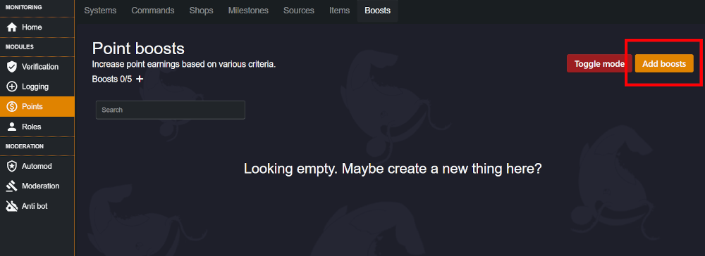

## What are Monni boosts?
Monni boosts are ways to multiply point gain for a member. We give boosts if people meet requirements, such as boosting a server or having a role. 

## Using Boosts with Monni
First you’ll want to head over to your dashboard and choose the server you’d like to add boosts too. 

Now, click on the points module. 

You’ll now be able to see the “boosts section” on the top navbar. Give that a click. 

To create a boost, you’ll want to click the “add boosts” button. 
   
We’re now granted with a menu for editing our boost. There are three sections. 

**MULTIPLIER**
This number multiplies gain from sources and other sorts of point income. Be careful how you use it, high multipliers build up fast.

**BOOST CRITERIA**
This is the requirement necessary to gain the boost. Currently you can select roles or boosts. More additions planned for the future.

**THIRD BOX**
This is used to edit functions related to your boost criteria. Role selection for example. 
Now, all you’ve got to do is create your boost and you're done. That's it for this guide.

---
Safe travels, Monni knows how rough those unknown waters get.