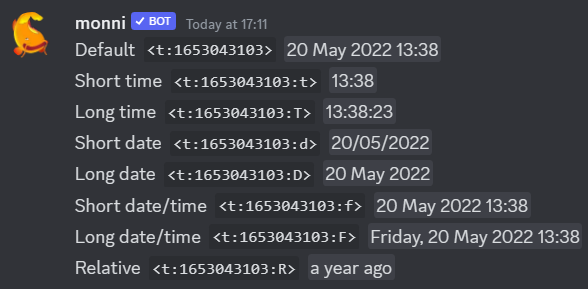
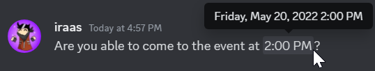

Discord has support for timestamps which are shown in users own local time and are automatically translated to their language. 

In case you need to get timestamp fast you can generate them below
<iframe
  id="inlineEditor"
  height="435"
  width="100%"
  src="https://monni.fyi/tools/timestamp?embed=true"
  allow="clipboard-write 'self' https://monni.fyi/">
</iframe>

## Timestamp structure
Timestamp consists of following structure

`<t:UNIX:FORMAT>`
<!-- truncate -->
`t` tells discord this is timestamp. 

`UNIX` is [Unix](https://en.wikipedia.org/wiki/Unix_time) time. Its a way to keep track of seconds from the unix epoch of **january 1st, 1970 UTC**. They are good for saving dates without the “worry” of [timezones](https://www.youtube.com/watch?v=rksaoaqt3JA). Hence discord uses them for timestamps

`FORMAT` tells discord the style for displaying the time like if it should be relative or if it should include minutes or only the year, month and date. You can find different format options below.

## Timestamp examples
In the examples following, unix timestamp `1653043103` is used with timezone being **utc+3 EEST**.

| Style           | letter | Input                | 12h                          | 24h                       |
| --------------- | ------ | -------------------- | ---------------------------- | ------------------------- |
| Default         | None   | ``<t:1653043103>``   | May 20, 2022 1:38 PM         | 20 May 2022 13:38         |
| Short time      | t      | ``<t:1653043103:t>`` | 1:38 PM                      | 13:38                     |
| Long time       | T      | ``<t:1653043103:T>`` | 1:38:23 PM                   | 13:38:23                  |
| Short date      | d      | ``<t:1653043103:d>`` | 05/20/2022                   | 20/05/2022                |
| Long date       | D      | ``<t:1653043103:D>`` | May 20, 2022                 | 20 May 2022               |
| Short date/Time | f      | ``<t:1653043103:f>`` | May 20, 2022 1:38 PM         | 20 May 2022 13:38         |
| Long date/time  | F      | ``<t:1653043103:F>`` | Friday, May 20, 2022 1:38 PM | Friday, 20 May 2022 13:38 |
| Relative        | R      | ``<t:1653043103:R>`` | a year ago                   | a year ago                |

:::info
Format of the timestamp (12h or 24h) changes according to your language settings.
:::

## Timestamps being rendered in discord

:::info
Want to know more about markdown? Enjoy our [in-depth guide](/blog/discord-markdown) on whats possible.

:::

## Useful resources
Third party discord timestamp tool
- [https://monni.fyi/tools/timestamp](https://monni.fyi/tools/timestamp)

Discord documentation section outlining timestamps.
- [https://discord.com/developers/docs/reference#message-formatting-timestamp-styles](https://discord.com/developers/docs/reference#message-formatting-timestamp-styles)

Gist on how timestamps work
- [https://gist.github.com/LeviSnoot/d9147767abeef2f770e9ddcd91eb85aa](https://gist.github.com/LeviSnoot/d9147767abeef2f770e9ddcd91eb85aa)

Wikipedia article on UNIX time system
 - [https://en.wikipedia.org/wiki/Unix_time](https://en.wikipedia.org/wiki/Unix_time)