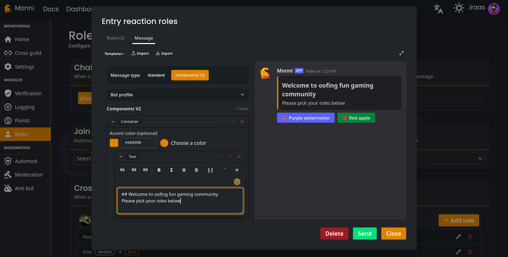

**Reaction roles** (or **Reaction Buttons**, to be exact) are officially back! While they were a staple of our old website we weren't able to include them in the rework of website. We've have now brought them back shinier than ever before with more control and customization.

## Why reaction buttons
Most Discord bots support "classic" reaction roles (using emoji reactions), but they often feel clunky, old and are prone to failure. By shifting to **button based roles** we opened the door for greater creative control, reliability and visually appealing server setups.

## New Features & Customization
We didn't just bring reaction roles back; we couldn't resist the temptation to make them better. Here are the major changes.

<!-- truncate -->
## Advanced modes
You can now control the logic of reaction roles. Choose from give distinct modes.
### Normal
The classic toggle. Click once to get the role, click again to remove it.

### Unique
Perfect choice for "pick one" scenarios. Selecting a new role automatically removes previous ones.

### Give only
Trick your member to select a role which they can't remove after.

### Remove only
Ideal choice for "opt-out" systems. Let members remove roles they don't want but don't let them get them back.

### Limit
Set a maximum number of roles member can hold. To get a new ones after limit they must manually deselect old one firsts.

## Multiple roles
You can now increase your efficiency and save time for your members with making one reaction button have multiple roles at once. No more having dozen of reaction buttons to give your members roles.

:::info
You can still set a button to give a single role if that’s all you need.
:::

## Black and whitelist
For the first time, you have full control over **who** can interact with your buttons. Restrict access based on existing roles to create tiered access levels or staff-only reaction buttons.

## ComponentV2 Message Editor & Live Preview

With the introduction of **Discord ComponentsV2**, our editor is more powerful than ever.
- **Total Creativity:** Combine embeds, normal text, and buttons seamlessly.
- **Live Preview:** See exactly what your buttons will look like _before_ you hit send.

## Ready to Level Up Your Discord server?

Don't let your members get lost in a sea of messy roles. Whether you're running a massive community or a private hangout, **Monni’s** reaction buttons give you the clean, polished look your server deserves.
### Get Started With Reaction Roles:

- **[Invite Monni to Your Server](https://monni.fyi/invite)** – Grant the permissions and you're ready to go.
- **Jump into the Dashboard** – Use `/dashboard` in your server to start building or head to [dashboard](https://monni.fyi/dashboard) directly.
- Head to **roles module**
- Press plus sign near reaction role card
- Configure the reaction role and press send.
- Remember to save or the reaction role won't work.
- **Need a Deeper Dive?** – Read our full [Reaction Roles Documentation](/modules/roles#reaction-roles) for a detailed guide.

