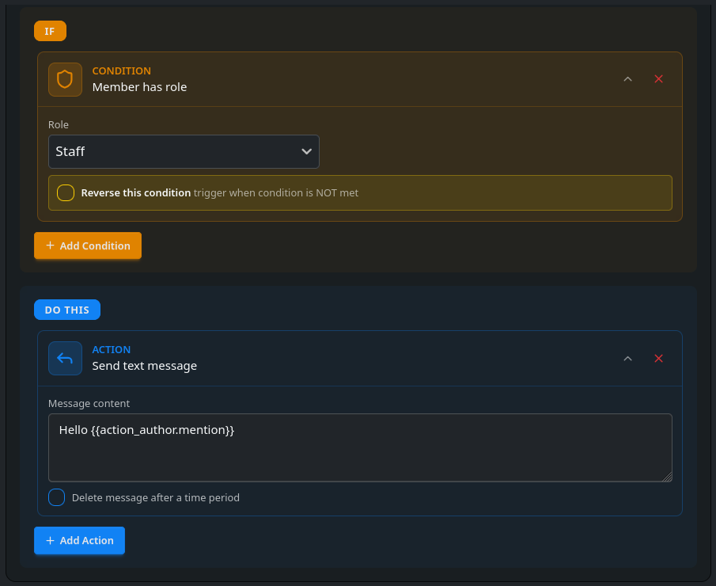
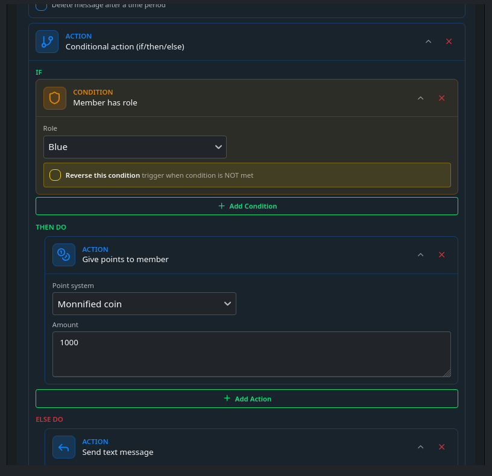
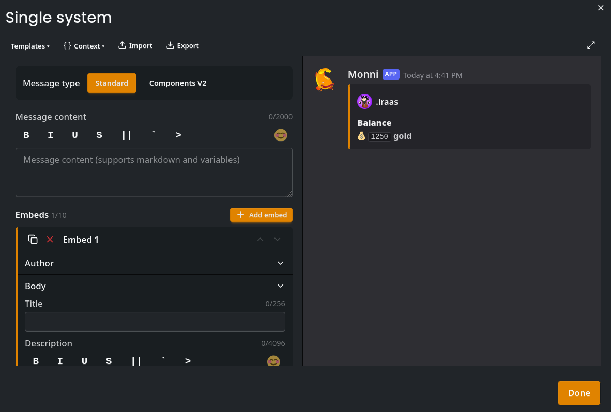
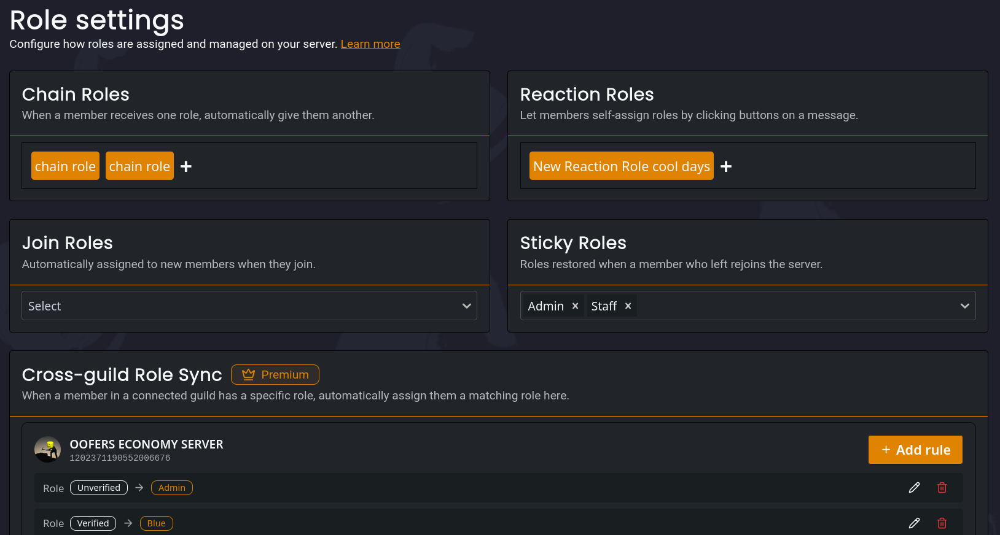
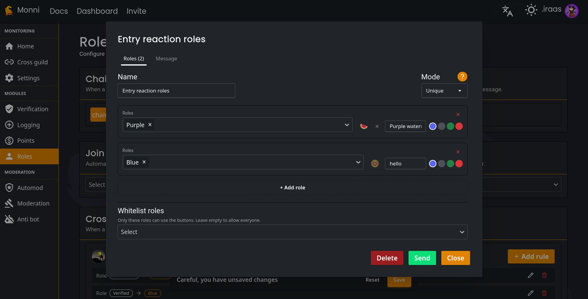
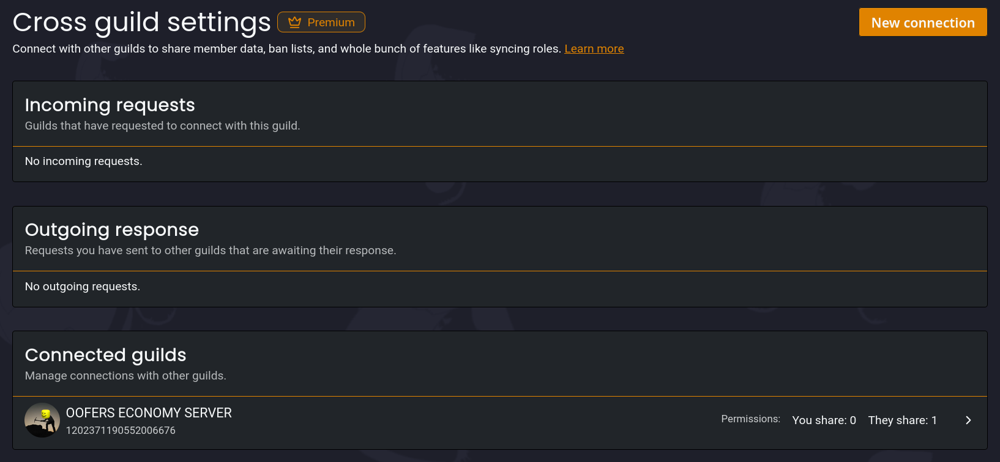
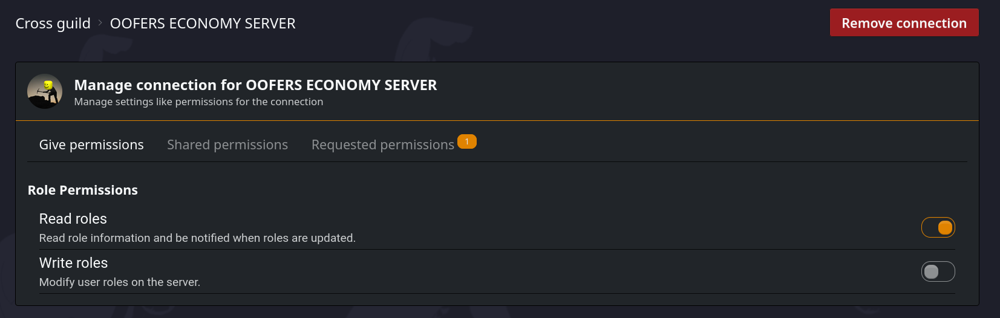
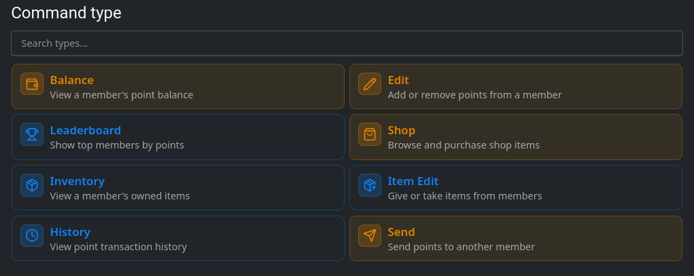

We didn't plan to do another point update so soon, but we felt that the last update had a few flaws and issues which we couldn't ignore. One big one was the embed editor which had some design flaws, and due to discord adding components V2 midway through our effort on creating the editor, we decided to rewrite it from the ground up. The new editor now has support for our new variable selector, which should make using variables multiple times easier. It also makes it possible to use loops and buttons. This was a big step forward as now all the commands can be rendered in the editor. Below are some of the new additions.

<!-- truncate -->

## Actions system
Actions felt like a system which had a lot of potential, but suffered from a poor UI and felt very limited. Not anymore! After a month building our new actions system, we've decided to let you guys use it too. It's now got a *far* better UI which is easier to use. Also, "Conditions" are now a thing. They let you set requirements for actions to work. An example would be: If somebody sends a message, they need to have a role, to get a point. The role is the "condition" here. 

As a side note, It's now designed in a manner which allows us to build on additional features far easier. 

## New message builder
As mentioned earlier, we've moved away from the old flawed editor to a new one which supports components V2. The biggest addition is in-editor support for buttons. This is most seen in commands. Now, every command uses our new editor under the hood, and some of the command logic can be edited if you want to. We also moved away from pre-existing styles in favour of one default style, switching to appliable templates for alternative styles. This reduces our upkeep work considerably and makes it possible to provide more existing templates. Commands now use a system we named slots. Each part of the command has its own "slot". A concrete example of this is the leaderboard, which has a slot for the leaderboard and a slot for when you try to access a page which doesn't exist. This lets you edit almost any part of the command. Super versatile!

## Role rework
This was the initial goal of the update and from there the scope creep came in. Initially we created the message builder for reaction roles. Beyond reaction roles we added cross guild role syncing and UI improvements. Cross guild roles lets you sync roles through multiple servers. So when a member gets a role in a Discord server A, the corresponding role is given in discord server B. We thought this'd be pretty damn nice for affiliate servers and clanning peeps.

Below is an example of our reaction roles UI. The reaction roles used to exist in the old website, but we didn't have time to add it in the website rework :(. This time around, it has a new mode for giving multiple roles in one go. Also, it works smoother with the message editor.

## Cross guild
The companion update to roles, and the beginning of our ambitious plans to build a world of linked guilds. Premium only due to the complexity. Right now, it lacks a lot features but the framework now exists. The idea behind cross guild is to provide a low trust way for two servers to share information like bans or roles. You send a connection request to another server. This is then approved by the other server and now you can request permissions, such as: Read roles, so features like sync roles can, as the name implies, sync the roles. The connection and permissions can be removed by either side at any point in time.

## Improved command type selection
Now instead of just selecting, you can choose command types from a grid and even see what the different commands do.

## Improved task system
One of the smallest changes yet quite important. We created a system which lets us ensure different background tasks like creating commands and in some cases giving roles are retried in case of failure. This should increase the stability of the command system and ensure even if a command registration fails, its retried, and you stay happy.