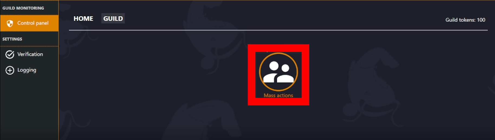

# Mass Actions

Mass actions is a tool which can be used to do things such as add roles to many people at once, or ban multiple users at the same time.

> **Members are selected through [FILTERS](/control-panel/mass-actions-info/filters). Some Filters include:**  
> _-Members with specific roles._  
> _-Days since members joined._

**Video:** [https://youtu.be/L9Gy4tA1PJM](https://youtu.be/L9Gy4tA1PJM)

## Where do I find Mass Actions?

You can access Mass Actions in your servers dashboard, at: **[https://monni.fyi/dashboard](https://monni.fyi/dashboard)**  
It can be found in **Control Panel** > **Guild**  

## How to use Mass Actions

Mass Actions is actually quite a simple and effective tool to use.

**1.** _First, select which Action you will use to find which members you will effect._

**2.** _Add a Filter to your Action. (This will be how you find the members you want)_

**3.** _Configure everything to your liking and press the Execute button._

---

You’ll be sent a confirmation message in direct messages after executing. It contains some basic information such as token cost, (If there is one) and who will be effected.

**Press the confirm button to proceed.**

> Make sure you have direct messages open so Monni can message you.

### More information

> If you are interested in details on Filters and Actions, you can find more information here: [**actions/filters**](https://docs.monni.fyi/modules/control-panel/actions-and-filters)