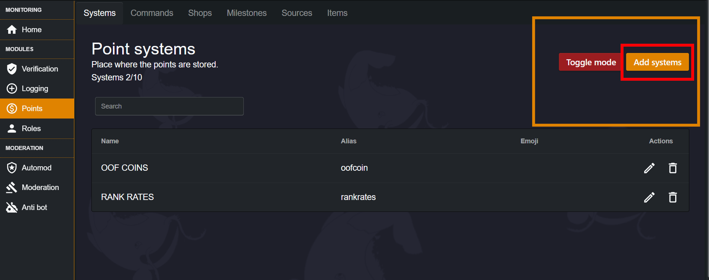
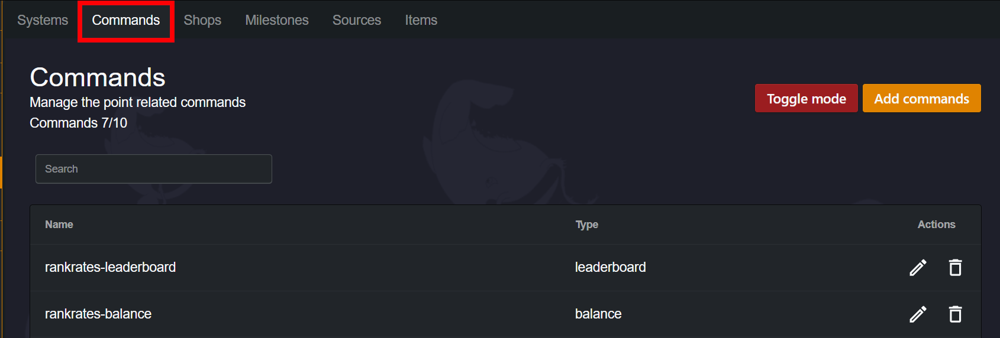
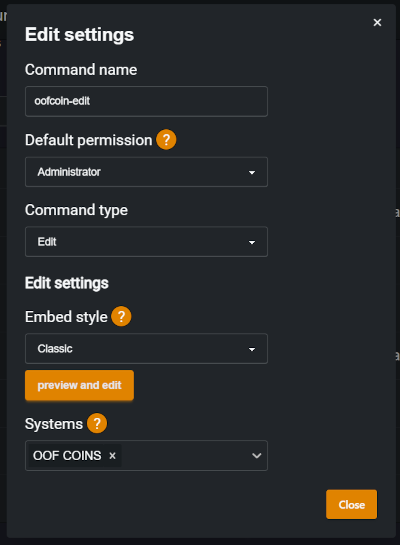
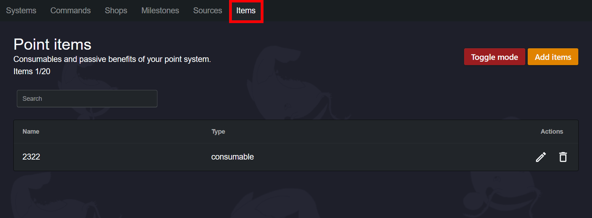
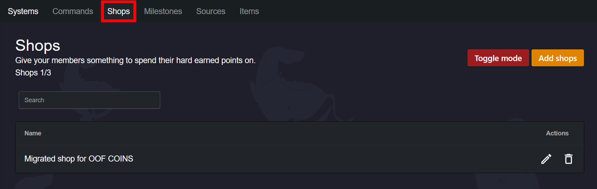
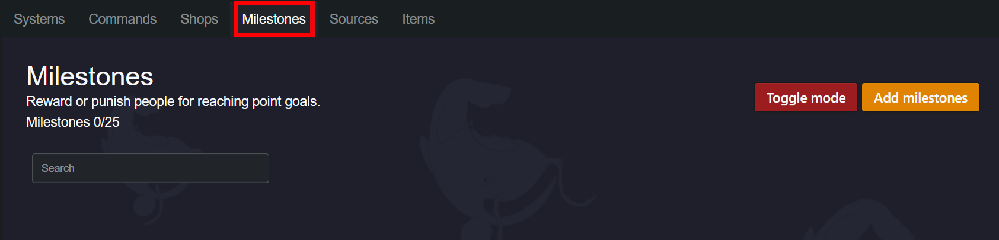
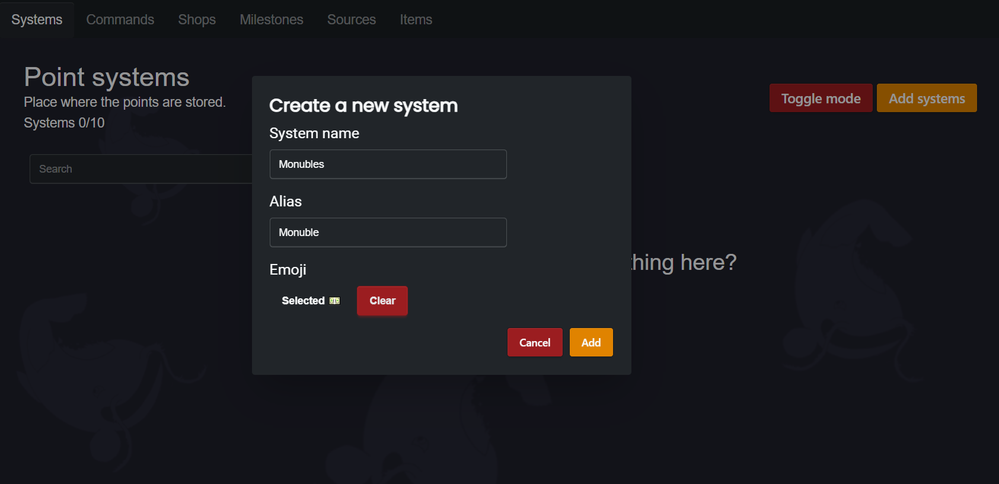
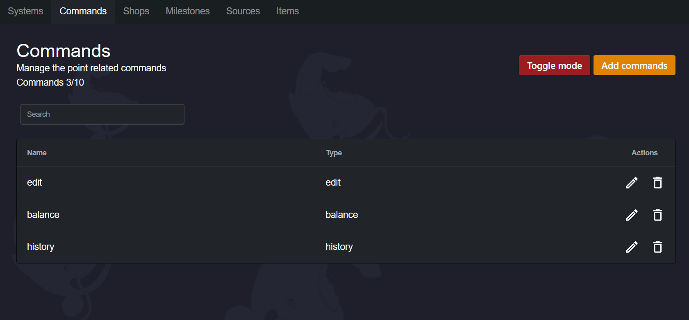
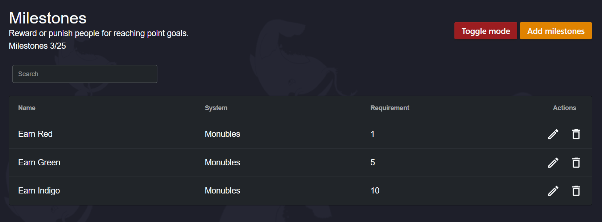
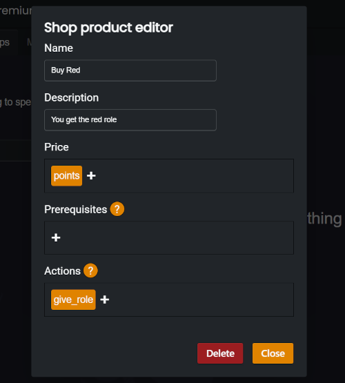

##### Our guide on setting up an Economy with Monni!
---
***
## What we're covering
You'll learn to use stores, where members can buy, trade, or be given Items, based on your settings. Then what those Items do. Want to add roles? let someone change their name? or perhaps even have a message sent when somebody receives one of your items!

We'll go over milestones, which cause things to happen when members reach a certain amount of points, as well as how to create points, and different ways members can earn them. 

Lastly we'll show you how to build some useful common systems. So grab a coffee and relax, your in good fins. 

# What are "Point Systems?"
Our point systems are essentially a currency. Each system is tied to its own currency, which you can name and add an emoji to. This name then shows up in commands you add to the system, so you know what system the command is for. 

As these are the basis for everything in our economy, you'll want to make one. You can do this by pressing "Add Systems". You can also change the style of the UI to your taste with the button next to it. In the example below we have OOF coins (A purchasing currency) and RANK rates (To keep track of when promotions happen) in one of my personal servers. Two useful ways to use points.

## Creating Commands
Commands directly tie in with your point systems, and there are a few different types, but first we'll want to create some. Head over to the Commands section and we'll have a look at what we can do with commands. 

Now add a command the same way you added a system before. You'll see a menu pop up, and you can use the Toggle Mode to edit these without the popup if you want. Now we'll go over what the different settings do.

In our command we have the name, which shows up in Discord. We also have the permissions, where you can allow different people to use the command in your server. 

You'll also see the "Embed style". You can choose from our embed types, or make your own. You can even add [Simpukka](docs/simpukka/index) variables in here.

Below this we have the "Systems" setting. This is the most important as this dictates what currency the command will effect. You can make it give multiple currencies at the same time, if you're crazy like that. Now, let's go over the types of commands. 
### Command Types
The main command types you'll want are "Edit" and "Balance", but we'll cover them all.

**EDIT**
This type of command lets you edit the amount of points somebody has. You can use a negative number to remove points.  You'll probably want this to manually change points in different circumstances.

**BALANCE**
Let's you see how much points somebody has. 

**SHOP**
Displays Items that are purchasable for points. We'll go over making shops and items later. 

**SEND**
This lets people send points from their own account into another persons account. 

**LEADERBOARD**
See how much points people have, displayed highest to lowest.

**INVENTORY**
Shows what Items a member has.

**ITEM-EDIT**
Lets you edit how many Items somebody has, works like the currency edit command. Mostly used for trading. 

**HISTORY**
Shows a general economic history of the member.

Now let's talk about Items.
## What are Items? 
Items are a tradable asset which when obtained can trigger an action of your choosing. They can be bought, given, or earned through Milestones. (We'll go over milestones soon.)

As for the "actions", these allow you to do things such as add/remove points, roles, or if you like  change a users nickname. These are generally self explanatory so you can mess around with them. Let's create our first Item by navigating to the "Items" section and creating an Item like we did a command. 

Now lets make the item. Once you've made it, you'll be able to name it, add a description of what it is (Shows up in shops which we're covering next), and add an image to present it with.

The most important thing here is adding an action. You can try adding the "Give Role" action to test your item, and give yourself the item with an item-give command! 

Now, we'll want somewhere to buy or even just get items for free. So lets create our shop. Navigate to the shop tab (Shown below)

Now create a shop, yep, same drill as the last things we created. Name it what you like. 
Next, create your first shop item. (Not to be confused with items). you can name it and give it a description. Let's take a look at the categories in the shop item's settings.

**PRICE**
This is where you'll select what currency the shop item accepts and how much of it is used. You can even buy it with items. 

**PREREQUISITES**
Works like price, but the currency or items won't be used during the purchase. 

**ACTIONS**
Here you can do general actions for what happens when the shop item is purchased. You can also allow an item to be given, so try adding the item you made before!

Now that we've gone over the base structure for a point system, let's discuss milestones and sources. 
## What are milestones?
Milestones are tools you can use to cause actions when a member reaches a certain amount of points. It comes with two different types of actions. Regular actions, which trigger when the member reaches the point amount, and reverse actions, which trigger when a member goes under the amount of points. You can access these from the milestones sections in the economy navbar. 

## What are sources? 
Sources allow your members to passively earn points. You can choose from a few options, such as messages sent or time spent in a VC. You can access it from the economy navbar, it's directly to the right of Milestones.

# Types Of Systems
Now that you know how to create an economy with Monni, we'll cover a few basic types of systems you can create with Monni. Of course, you can really make anything you want! 
## Regular Tradable Currency
Usually used to keep track of services you offer for other currencies outside Monni. Though this is a great foundation system for anything. First we create a system:

Now lets make our commands. Head over to the commands section. We're going to create three commands. Make sure to set all of them to use the system we made beforehand. 

**Edit**
**Balance**
**History**

Now name them and keep the permissions as administrator. You can customise the embed if you want.

Now give your commands a try in your Discord server! You now have the foundation to build any system on. 
## Milestone Role Gain 
One useful type of system is to automatically give roles to people as they earn points. You can then distribute those points for things like event participation or chat activity. You'll need a currency system made to create this, which you can create by following the Regular Tradable Currency guide.

**First** create some roles. For this we'll just create three roles, but you can make more if you like.

**Next** head over to the Milestones section. We're going to create three milestones. 
*Set your first to require 1 point, the second to require 2, and the third to require 3.* 

Now, inside your first item, create an action and select "Give role" and select one. Then, create a reverse action and select "Remove role" and select the same role. Repeat this for the other items and just change the role to the one you'd like. 

Now try giving yourself some points with an edit command and watch Monni role you! You can remove points and they'll automatically be taken if you fall under the amount. 
## Buyable Roles
Let members buy roles from your store. Great way to let members earn cosmetic roles or earn access to different places. You'll need a currency system made to create this, which you can create by following the Regular Tradable Currency guide.

**First** we create a shop in the shops menu. I just called mine the "Role Store".

**Next** we create the items. We add our price, which should be set to the system we created before. Set this to the amount you want it to cost. 

**Lastly** we set the action. Simply select the give role option and choose the role of your liking. 

Now all you have to do is repeat this step for any roles you'd like to sell. 
# Conclusion
You have all the knowledge required to develop your own economy with Monni :). 
Don't forget to join the [community server](https://discord.gg/kEKuDRE3Jv) for help with issues, and also as a place to hang out!