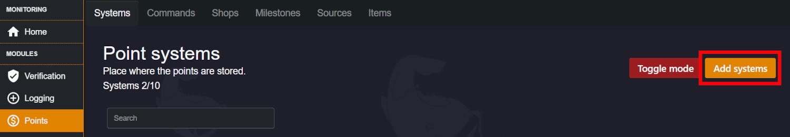
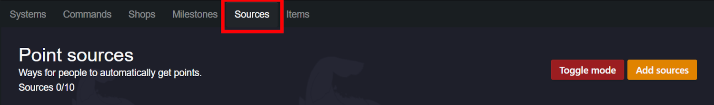

###### Want to reward people for inviting new members? Here's how!
___

### How does it work?
---

Our [Points Module](/modules/points) has a built in way to create a point system designed to encourage members to invite more people to the server. Invites are tracked in the same way they are tracked under the Invites tab in Server Settings. An invite is created by a user, and every time it is used the member who created the invite will receive a point.

### Creating the tracking system
---

1. Go to the [Monni Dashboard](https://monni.fyi/dashboard), then your server, and go to the *Points Module*. In the systems tab, select "Add system".

2. Now name your currency, something like "Invite Count". Next set the alias, which will be the name of our commands later. 

3. Head over to the "Sources tab" and click "Add sources". Give it a name, like "Invite Points".

4. In Point Systems, select the point system we made previously. These will be the points a member gets for inviting people. 

5. Lastly select "People Invited" as the source. Now you can choose how much points a member gets for inviting somebody. 

You can now add things like milestones for your system or shop items. Enjoy!

### Troubleshooting
---

Sometimes, due to a few common errors, the invite tracking system won't work. This could be due to two main reasons:
- Monni does not have the "manage roles" permission required to perform reward actions.
- Monni does not have the permissions required to view the audit/invite logs.

A good way to check whether a point system works is to test the balance after it should have gone up, and the shop to make sure Monni has all the permissions required. This can be done as in the image:

If there's any issues or you have questions that go further in depth than this guide, check out our [community server](https://discord.gg/kEKuDRE3Jv) where staff can help answer any questions.
