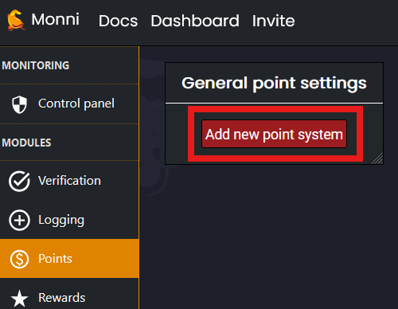
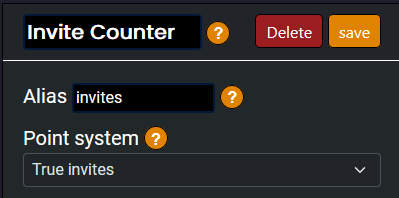
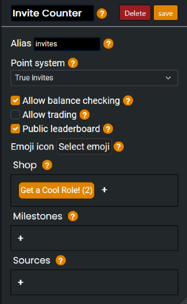
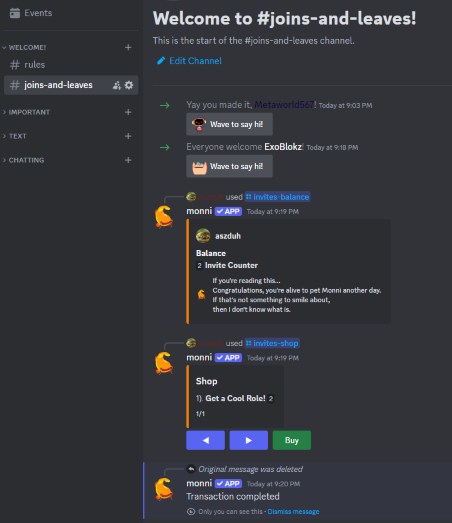

###### Want to reward people for inviting new members? Here's how!
___

### How does it work?
---

Our [Points Module](/modules/points) has a built in way to create a point system designed to encourage members to invite more people to the server. Invites are tracked in the same way they are tracked under the Invites tab in Server Settings. An invite is created by a user, and every time it is used the member who created the invite will receive a point.

### Creating the tracking system
---

1. Go to the [Monni Dashboard](https://monni.fyi/dashboard), then your server and go to the *Points Module*. In the module tab, select "Add new point system".

2. Set the name to anything you prefer, in this case "Invite Counter", and then set the alias that is used in the point commands as found [here](/commands/slash/point-commands); in this case, "invites". Also set the *Point System* option to either "True invites" or "Invites"
	- True invites only add points to members when the invitee is joining for the first time, while Invites will always add a point to the member.
	- It's also a good idea to enable balance checking and a public leaderboard to allow for some competition between members.

3. As an option to reward people for inviting others, you can use either a shop item or milestone as described in the [Points Module](/modules/points). Once you set these rewards up to your liking, make sure you hit save!
	- For this point system setting, a source for point is not needed as selecting True invites or Invites is a source of its own.

### Troubleshooting
---

Sometimes, do to a few common errors, the invite tracking system won't work; this could be due to two main reasons:
- Monni does not have the "manage roles" permission required to perform reward actions
- Monni does not have the permissions required to view the audit/invite logs

A good way to check whether a point system works is to test the balance after it should have gone up and the shop to make sure Monni has all the permissions required. This can be done as in the image:

If there's any issues or if you have questions that go further in depth than this guide, check out our [community server](https://discord.gg/kEKuDRE3Jv) where staff can help answer any questions.
