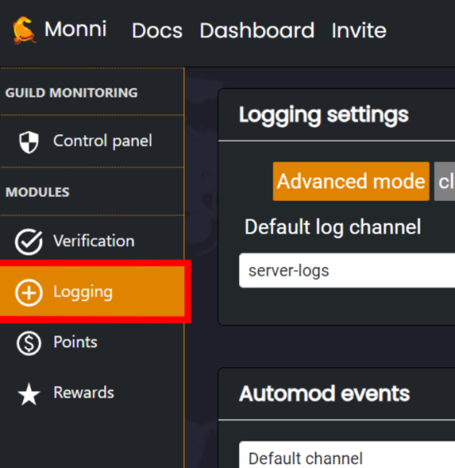

##### Guide to building your own event logging system!
***
### Logging
***
With Logging, you can store things like **Deleted Messages** and **Role Changes** in channels you choose. There are tons of log-able events you can enable so you can make sure nothing gets passed your eyes!

<iframe width="560" height="315" src="https://www.youtube.com/embed/DPayadIep6c?si=XTaz2UWTPGmJp0_x" title="YouTube video player" frameborder="0" allow="accelerometer; autoplay; clipboard-write; encrypted-media; gyroscope; picture-in-picture; web-share" referrerpolicy="strict-origin-when-cross-origin" allowfullscreen></iframe>
***
### Where do I find Logging?
---
You can find the Logging Panel at the dashboard, at **[https://monni.fyi/dashboard](https://monni.fyi/dashboard)**  
It can be found in the **sidebar on the left** under **modules**.

***
### How to use Logging
---

You’ll find it easy to get used to our simple Logging interface.

1. **First notice panels on the right.** These are groups of similar events. You can check the boxes in the panel to enable or disable the group’s events!

2. **Now you need to select where you want those events to be logged.** Just click on the drop down button above the event checkboxes. All your server’s channels are there, choose one!

3. **Want to reset everything?** Press that clear button!

***
