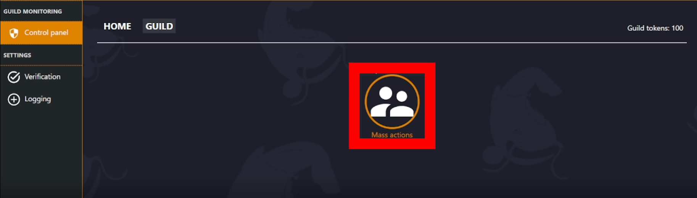

##### Need to do a lot at once? Here's how!
---
Mass actions is a tool which can be used to do things such as add roles to many people at once, or ban multiple users at the same time.

:::info
**Members are selected through [FILTERS](https://docs.monni.fyi/modules/control-panel/actions-and-filters). Some Filters include:**  
- Members with specific roles.  
- Days since members joined.
:::

<iframe width="560" height="315" src="https://www.youtube.com/embed/L9Gy4tA1PJM?si=goZhBvMPTXK7TH1t" title="YouTube video player" frameborder="0" allow="accelerometer; autoplay; clipboard-write; encrypted-media; gyroscope; picture-in-picture; web-share" referrerpolicy="strict-origin-when-cross-origin" allowfullscreen></iframe>

### Where do I find Mass Actions?
---
You can access Mass Actions in your servers dashboard, at: **[https://monni.fyi/dashboard](https://monni.fyi/dashboard)**

It can be found in **Control Panel** > **Guild**

### How to use Mass Actions
---
Mass Actions is actually quite a simple and effective tool to use.

1. _First, select which Action you will use to find which members you will effect._

2. _Add a Filter to your Action. (This will be how you find the members you want)_

3. _Configure everything to your liking and press the Execute button._
***
You’ll be sent a confirmation message in direct messages after executing. It contains some basic information such as token cost, (If there is one) and who will be effected.

**Press the confirm button to proceed.**

:::warning
Make sure you have direct messages open so Monni can message you.
:::
***
### Extra
---
The currently available filters are:

1. **ROLE** | Finds a user, if they have a role you select. 
**REVERSE** | Finds a user, if they **don’t** have a role you select.
2. **JOIN TIME** | Finds a user, if they’ve been in the server for less days than you selected. 
**REVERSE** | Finds a user, if they’ve been in the server for **more** days than you selected.
3. **ACCOUNT CREATION TIME** | Finds a user, if their discord account is younger than days you selected. 
**REVERSE** | Finds a user, if their discord account is **older** than days you selected.
4. **LAST ONLINE ROBLOX** | Finds a user, if they’ve not been online for amount of days you choose. 
**REVERSE** | Finds a user, if they’ve **been online** for amount of days you choose.

The currently available actions are:

1. **BAN** | Bans selected members from the server.
2. **KICK** | Kicks selected members from the server.
3. **REMOVE ROLE** | Removes roles of your choice from selected members.
4. **ADD ROLE** | Adds roles of your choice to selected members.

:::note
Some Actions and Filters cost [**guild tokens**](https://docs.monni.fyi/FAQ/guild-tokens). You will be notified of the cost via DM before you confirm execution of the action.
:::