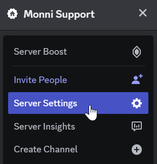
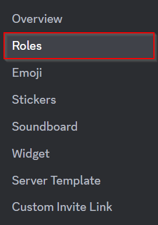
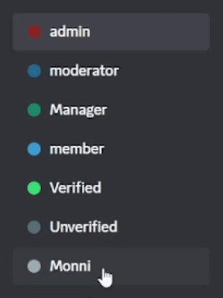

###### Guide for the importance of role hierarchies!
---

### What is role position?
---
In Discord, the role's position in the hierarchy defines who can do actions to who. Lower roles in the hierarchy cannot affect people with roles higher up in the hierarchy. The actions which are affected by hierarchy include but are not limited to managing roles, changing nicknames, and performing moderation actions.

:::info
Own is always on top of the hierarchy, and cannot be changed.
:::

### How can I change role position?
---
Open Discord's server settings. Then select "Roles".

Once the "Roles" section is open drag the "Monni" role above the other roles.

### Why is role position important?
---

A role's position in the hierarchy affects what actions can be done to it and to other roles. In the case of Monni, if the role position is not correct it will be unable to assign roles, manage nicknames, or handle moderation actions for you.