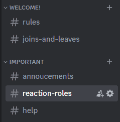
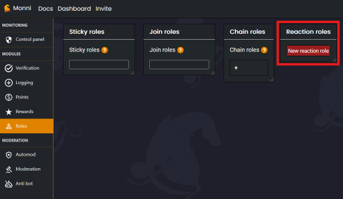
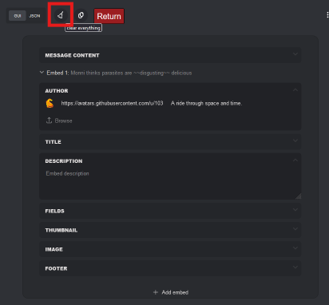
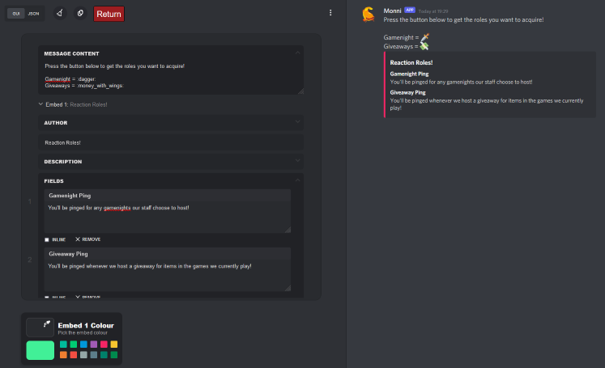
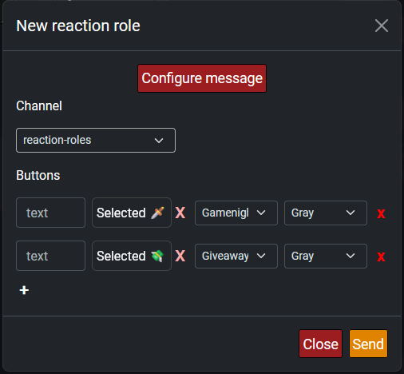
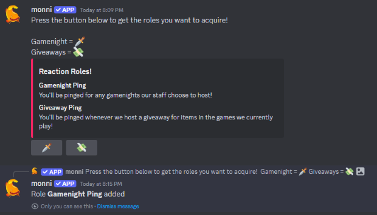

###### A quick guide to self-roling using reactions!
___

### Why use reaction roles?
---

Reaction roles allow server members to role themselves as they wish. It is used for choosing specific pings or identifying roles, like time zones, without the need for an admin to give roles to everyone.

### Setting up reaction roles
---

1. Create a channel where the reaction roles message will be placed, preferably where no one else will talk, otherwise the message will get lost in a list of other messages.

2. Go to the [*Monni Dashboard*](https://monni.fyi/dashboard), then go to your server and select the roles module. Next, under *Reaction roles* select "New reaction role".

3. In the menu that has just popped up, press "Configure Message" to open the message editor and in the top left corner click the brush to clear the template message.

4. Create a message to explain what each role's purpose is to make choosing easier for server members.

	The easiest way to do this is by using `Message Content` and `Fields` in the editor.
	- The `Message Content` field is for all information outside of your embed.
	- Create a title in the `Title` field for your embed which will be bolded and slightly larger than other text in your embed.
	- The `Fields` field creates sections with a bolded title in your embed that can be used for explaining the purpose of each available role.
	- The `Embed Colour` option allows you to set the colour of the left border of the embed, in this case, red.

5. Press return and set which channel you'd like your reaction role message to be sent in. Then select the buttons which will be under your embed. (These assign the roles)

	- The `text` field is optional, but can be used instead of specifying the emoji that each role is related to in the message created in step four.
	- The "Select emoji" button allows you to choose an emoji that will be displayed in the button.
	- The `role` field allows you to select what role is applied by each button, the role must be <u>under</u> Monni in the role hierarchy to be selected, as described in the [**Monni Role Position**](monni-role-position) guide.
	- A colour for the button can also be selected, but the available options of blue, green, red, and grey are the only colours supported by Discord.

5. *Press send!* 
 
	 The message will appear in your chosen channel. You can remove a reaction role by clicking the button again.

