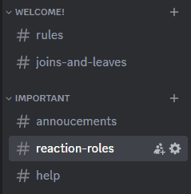
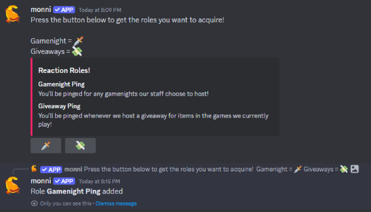

###### A quick guide to letting members pick their own roles
___
### Why use reaction roles?
---
Reaction roles let members give themselves roles by pressing buttons on a message. They are great for opt-in pings, like game night or giveaway pings, and for roles like time zones or pronouns, without an admin having to give everyone their roles by hand.

### Setting up reaction roles
---

1. Create a channel for the reaction role message. It works best in a channel where nobody else talks, so the message doesn't get buried.

2. Go to the [*Monni Dashboard*](https://monni.fyi/dashboard), pick your server and open **Roles**. Under **Reaction Roles**, press **+** to make a new set of buttons.

3. Give the set a **Name**, so you can find it later, and choose a **Mode**. **Normal** lets members pick as many roles as they like. **Unique** only lets them have one at a time. All modes are explained on the [Roles](/modules/roles#modes) page.

4. Press **+ Add role** for each button. For each one, pick the roles it gives, write a label, add an emoji if you like, and pick a color.

	- A message can have up to 5 buttons, and one button can give several roles.
	- The roles must be **below** Monni's role, as described in the [**Monni Role Position**](monni-role-position) guide.
	- Use **Whitelist roles** if only some members should be able to use the buttons, for example only verified members.

5. Open the **Message** tab and write the message the buttons will be under. Explain what each role is for, so members know what they are picking. The preview on the right shows what it will look like in Discord.

6. Press **Send** and pick the channel from step 1. The message appears in that channel straight away. Members press a button to get the role, and press it again to remove it.

:::info
To change a message you already sent, open the set again, press **Send**, and paste the message link under **Update existing message**. Monni edits the old message instead of posting a new one.
:::
