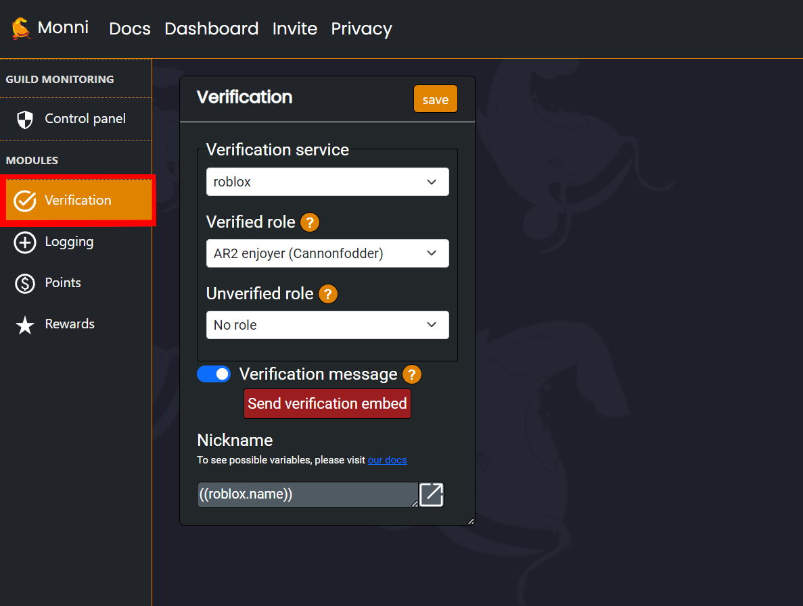

This step by step guide will allow you to quickly set up secure and efficient verification for your discord server.

<iframe width="560" height="315" src="https://www.youtube.com/embed/m6QLpJv8UhQ?si=GYgSU2xD9SCVi13m" title="YouTube video player" frameborder="0" allow="accelerometer; autoplay; clipboard-write; encrypted-media; gyroscope; picture-in-picture; web-share" referrerpolicy="strict-origin-when-cross-origin" allowfullscreen></iframe>
***

### Setting up Discord-Roblox verification
***
1. Once Monni is invited to your server, you can head over to our website, [https://monni.fyi](https://monni.fyi)
2. Login with your discord account and head over to the dashboard to select the server you want to add verification to!
3. Once you have selected a server, you will see the “Verification” panel.

4. Enable Roblox verification
:::note
There are still a few settings you will need to edit, so let's go over them below.
:::
***
- **Verified Role |** This is the role your members will get when verified. You can select an already existing role, but if you don’t, one will be created for you.
- **Unverified Role |** This is the role your members will get when they first join your server before verifying. You can select an already existing role like before, or one will be created for you if you don’t.
- **Verification Message |** You can enable the toggle button for the join message, which will send members a DM to verify when they join if enabled.
- **Verification Embed |** You can send this to a channel of your choice by clicking the embed button. It is highly configurable when using [simpukka variables](https://monni-docs-f7dj.onrender.com/simpukka/).
- **Nickname |** You can set nicknames for your members. To set a verified user’s name to their Roblox account username, check out [simpukka](https://monni-docs-f7dj.onrender.com/simpukka/).

### Using Discord-Roblox verification
***
:::info
**Using your now set up verification is actually very simple!**  
Just use the “**/VERIFY**” command in your server and follow along with its steps! You can also click the verify button on the embed to begin the Verification process.
:::
***
