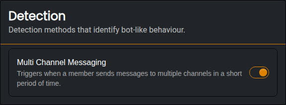
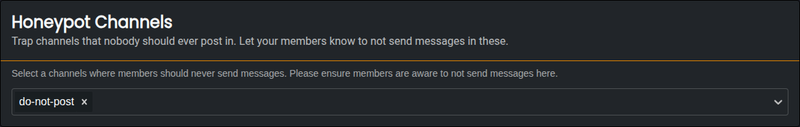
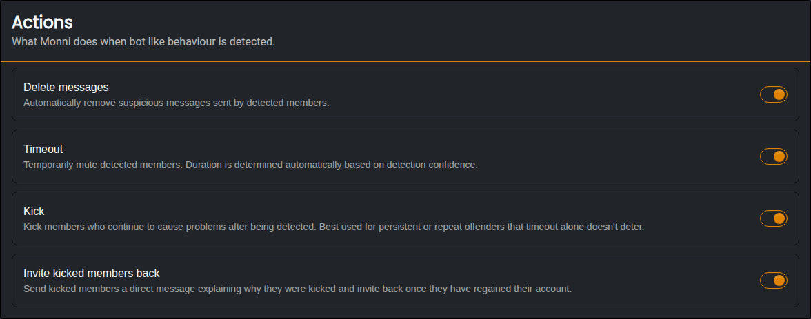
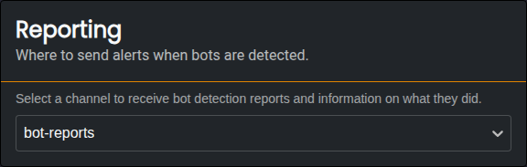

###### Module for preventing bot spamming and raiding
***
The Anti Bot Module is designed to catch compromised accounts and spam bots that post scam messages across your server. It watches for bot-like behaviour, warns the member first, and then removes them if they keep going.

:::info
Members with **Administrator**, **Manage Messages** or **Moderate Members** permissions are never checked by Anti Bot. Neither are other bots.
:::

### Detection
***
Monni currently has one way to detect bots.

#### Multi Channel Messaging
***
When enabled, Monni will detect members that send messages to many different channels in a short period of time. This is how most scam bots behave, as they try to reach as many people as possible before being removed.

- A member is caught when they post in **5 different channels within a minute**.
- This drops to **4 channels** if they are posting the same message in each channel, or if your server only has a few channels they can post in.
- Once a member has been caught, Monni watches them more closely for the next few hours.

#### Honeypot Channels
***
A honeypot is a channel that nobody should ever post in. Bots post everywhere they can, so any message sent in a honeypot channel is treated as bot behaviour.

- The message is always deleted.
- The member gets a notice in the channel telling them what they did, and gets a [strike](#warnings--strikes).

:::warning
Make sure your members know not to post in your honeypot channels! A good way to do this is to name the channel something like **#do-not-post** and explain it in the channel's messages..
:::

### Warnings & Strikes
***
With Multi Channel Messaging, Monni always warns a member before punishing them. When a member is one step away from a punishment, Monni posts a short warning in the channel they just used, telling them what will happen if they continue. The warning disappears after a few seconds.

If they keep going, or post in a honeypot channel, they get a **strike**:

- **1st strike** | The member is timed out for 1 minute.
- **2nd strike and onwards** | The member is kicked from the server. If you have kicking turned off, they are timed out for 24 hours instead.

Strikes expire 1 hour after a member's last strike, so a member who trips detection once in a while will never build up to a kick.

### Actions
***
Actions let you choose what Monni is allowed to do when a member gets a strike.

- **Delete Messages** | Deletes every message the member sent while they were being caught, across all channels.
- **Timeout** | Allows Monni to time members out. If turned off, the first strike is only reported.
- **Kick** | Allows Monni to kick members on their second strike. If turned off, they are timed out for 24 hours instead.
- **Invite Kicked Members Back** | Sends the member a direct message explaining why they were kicked. The message includes an invite back to your server, which can be used once and expires after 7 days. This is useful because most bots are real members whose accounts were hacked.

:::warning
Kicking a bot doesn't stop it from joining again. If you see the same account being kicked again and again in your reports, ban it using the [**Moderation Module**](/modules/moderation).
:::

Every timeout and kick from Anti Bot is saved as a case in the [**Moderation Module**](/modules/moderation), so you can see them alongside your other cases.

### Reporting
***
When a channel is selected, Monni will send a report there every time a member gets a strike.

Each report includes:
- The member and what they did.
- The action that was taken, and the strike they are on.
- A file with every message they sent while being caught.
- Whether anything failed, such as Monni lacking the permissions to kick or a message that could not be deleted.
- Whether Monni could not send the member a direct message.

:::info
Make sure Monni has the **Moderate Members**, **Kick Members** and **Manage Messages** permissions, or the punishments will fail. Failed actions are always shown in the report.
:::
