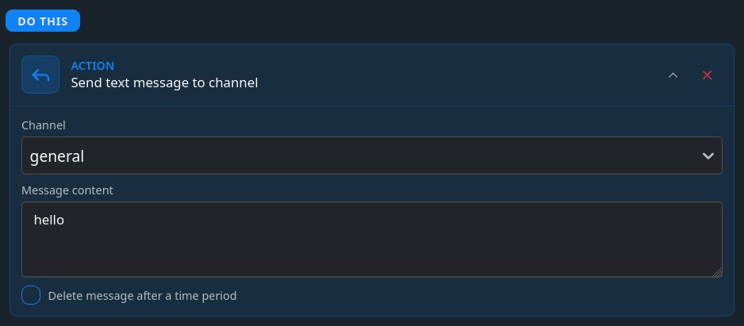
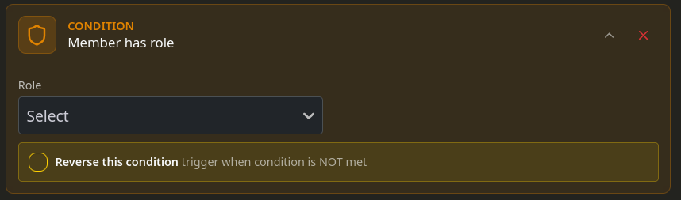

Actions and conditions are the heart of any system which supports them. They provide the bot instructions on what to do and when it should apply. Combined they can be used to create complex logic flows perfect for making Monni customized to exactly the degree you need.

## Actions
Actions are usually colored blue and tell the bot what to do. Actions range from simple actions like banning a member to providing sending messages with buttons which have their own actions.

### Target of actions
Actions don't know themselves who to target. The information is provided by the component which runs the action. In case of a button the actions apply to the person who pressed the button

:::info
Even when the target isn't documented, we aim to ensure it is immediately clear from the context.
:::

### Special actions
Non comprehensive list of special actions
- For each member. Runs actions on group of people based on filters. Read more in [mass actions](mass-actions)
- Conditional. Let's you define conditions and what actions to run if they apply and what actions to run in case they don't apply

## Conditions
Conditions are usually colored orange and work as the IF statements of the system. They can be used inside actions to control the flow of the actions. For example check if user has a role **purple**. If they do then do give them **20 points** otherwise do nothing.

## Action system limits
Currently we don't enforce any limits on actions. We monitor for harmful abuse usage and we will limit any server found to be partaking in trying to harm our systems. 

:::info
We wish to keep the system limit free but we may change this in future if the system is abused.
:::