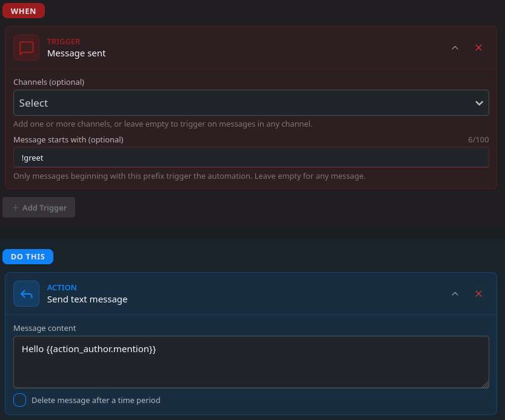

###### Module for creating custom automations and commands
***

Automations let you create custom commands and actions which run based on schedule, timer or triggers like message sent. Automation module documentation also encompasses information about our action system and mass actions 



## Related topics
```mdx-code-block
import DocCardList from '@theme/DocCardList';

<DocCardList />
```