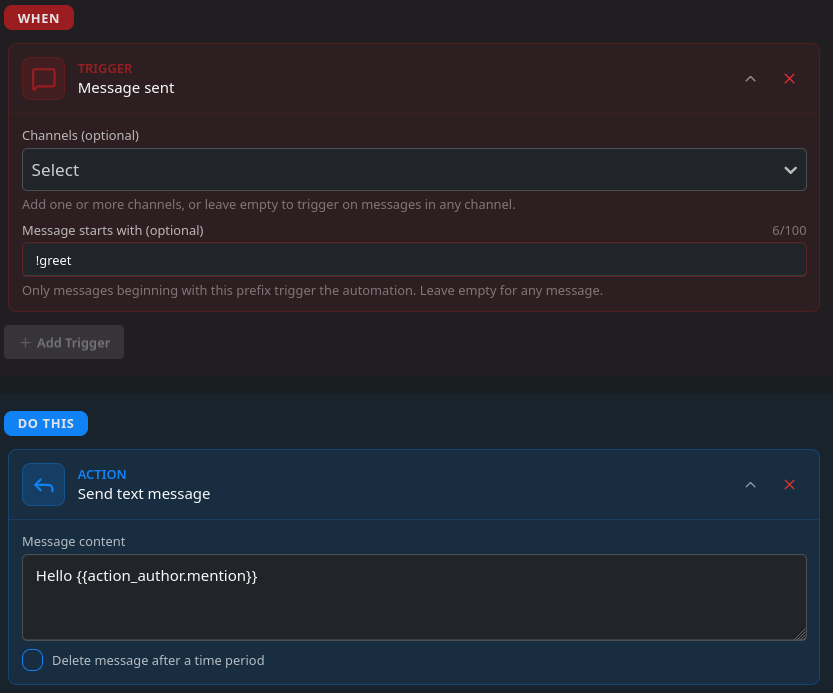

###### Module for creating custom automations and commands
***

Automations let you create custom commands and actions which run based on schedule, timers, or triggers like message sent. The automation module documentation also encompasses information about our action system and mass actions 



## Related Topics
```mdx-code-block
import DocCardList from '@theme/DocCardList';

<DocCardList />
```