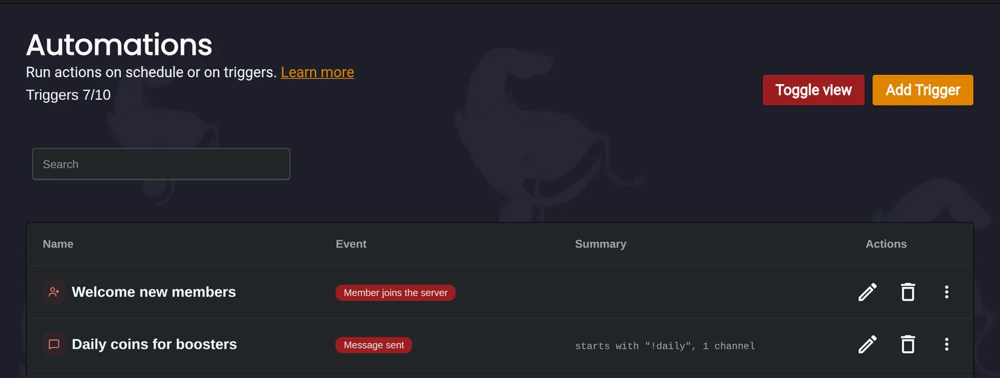

###### Module for creating custom automations and commands
***

Automations let you build your own commands and actions without writing code. Each automation has a **trigger** that decides when it runs, and **actions** that decide what happens. You can add **conditions** to only run actions for some members, like members with a certain role.



### How an automation works
***
Here is a complete example. When someone sends a message starting with `!daily` in #general, Monni checks whether they have the **Server Booster** role. Boosters get 50 coins and a thank you message. Everyone else is told what daily coins are for.


- **Trigger** | When the automation runs. See the [triggers](#triggers) below.
- **Conditions** | Checks like "member has role" or "member has points". Add them with the **Conditional action**, which runs one list of actions when the conditions pass and another when they don't.
- **Actions** | What Monni does, like sending a message, giving a role or changing points. Read more on the [Actions and conditions](actions-and-conditions) page.

### Triggers
***
- [**Message sent**](triggers/message_sent) | Someone sends a message, optionally only in some channels or starting with a command.
- [**Member joined**](triggers/member_joined) | Someone joins your server.
- [**Member left**](triggers/member_left) | Someone leaves your server.
- [**Member verified**](triggers/member_verified) | Someone finishes verification.
- [**Timer**](triggers/timer) | Runs again and again at a fixed interval.
- [**Schedule**](triggers/cron) | Runs at set times, like every Monday at noon.
- [**Manual**](triggers/manual) | Only runs when you start it from the dashboard or the API.

### Running actions on many members
***
To run actions on many members at once, like giving everyone with one role another role, use the **For each member** action. Read more in [Mass actions](mass-actions).

## Related Topics
```mdx-code-block
import DocCardList from '@theme/DocCardList';

<DocCardList />
```