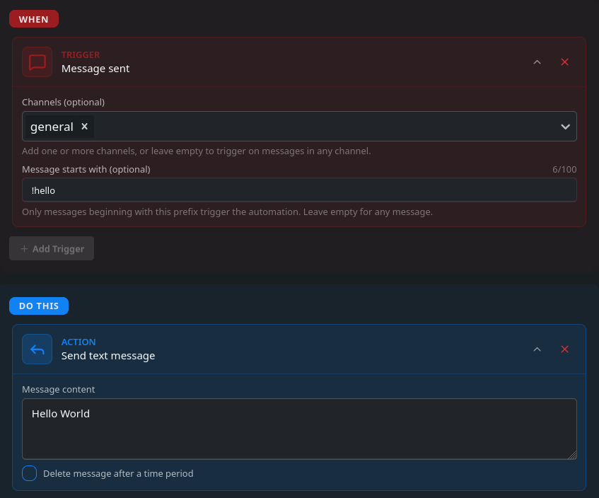

Lets start with a classic hello world example.
1.  create a message trigger with the prefix of `!hello`. This way the bot knows to respond to messages starting with `!hello`
2. Then add the `Send text message` action and set the message as `Hello World`.
3. The bot will now respond with `Hello World` when `!hello` is sent.

