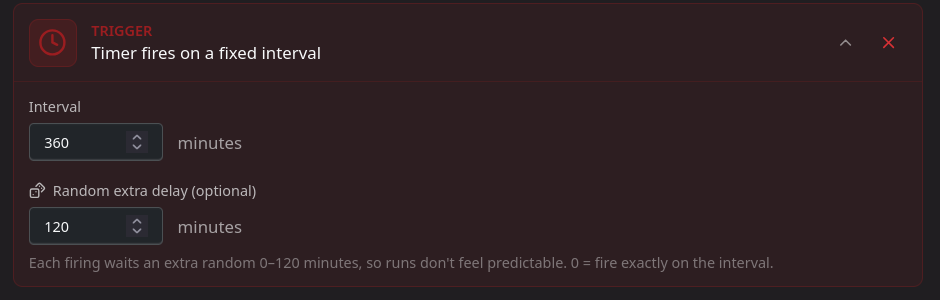
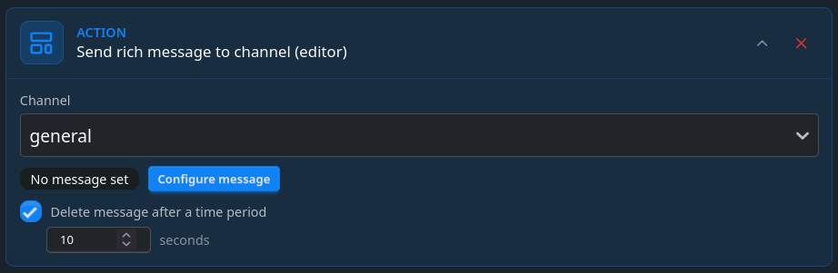
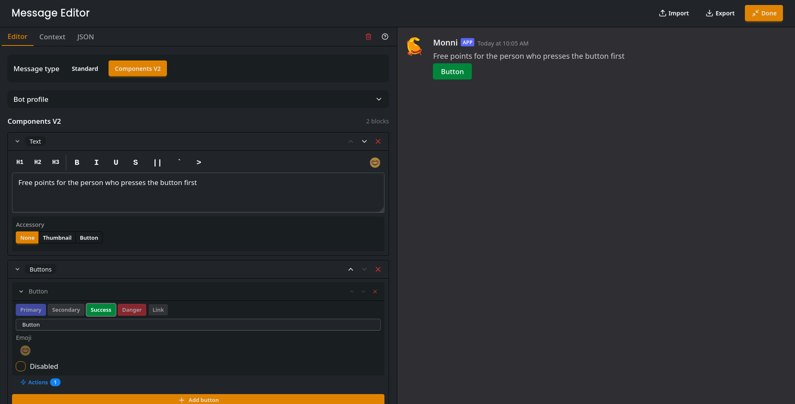
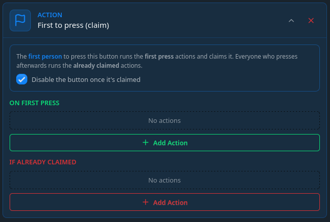
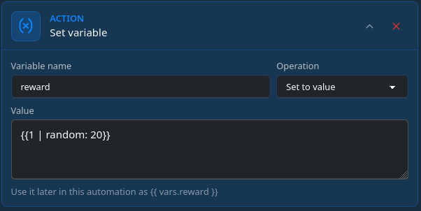
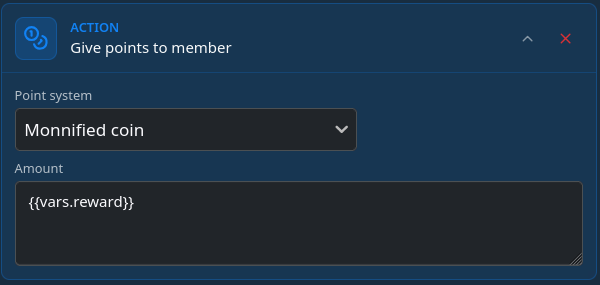
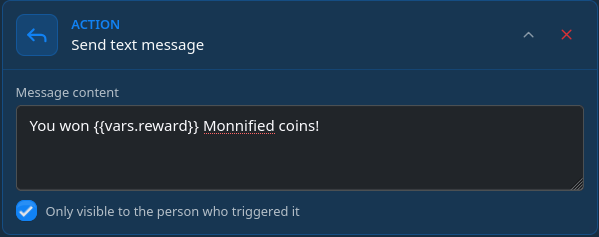
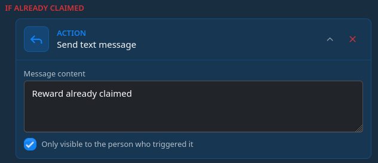

# Random interval reward message
To increase the activity in your server you might want to have a message sent randomly which can be claimed by the fastest person for a reward. You can make this in a way where the message will be deleted after a set amount of time to avoid messages piling up on slow activity.

### Reward trigger
To create this with automations you first need a **6 hour timer** `(360 minutes)` and a random period set, such as **2 hours** `(120 minutes)`. 



### Reward message action
The next step is configuring the reward message itself. Create a `Send rich message to channel` action. 



:::info
Optionally, you can set the `Delete message after a time period` if you want to avoid messages cluttering the channel and avoid them piling up during slow periods. 
:::

### Configuring the message
Press the configure message button in the action and get creative. Just ensure you have at-least one button to program.



### Creating actions for the button
First create a first to press action. This ensures only the first to press the button gets to claim it. Optionally, enable the disable button checkbox.


As we want the reward amount to be random, we need to generate it. As we need the value in two different actions, later on we will store it in a variable. Inside `in first press`, add a variable action with a random number being made with the [random filter](/modules/automations/custom-tags-and-filters#random). It uses the following syntax:
```
{{min | random: max}}
```
To give a random amount of points from 1 to 20 we will write to the variable:
```
{{1 | random: 20}}
```
Also set the variable name to reward.


Now that we have the reward amount, lets add a give points action which gives `{{vars.reward}}` amount of points.



The Winner should be informed that they were the first to press the button so lets add a `send message` action with information on how many points the person won. Optionally you can make the message private so only the winner sees they won.



Lastly, an optional thing is to setup an `if already claimed` action. Even if the button disabling is enabled there is a chance somebody else also presses the button before it gets disabled. This ensures they get informed they were too slow. 



