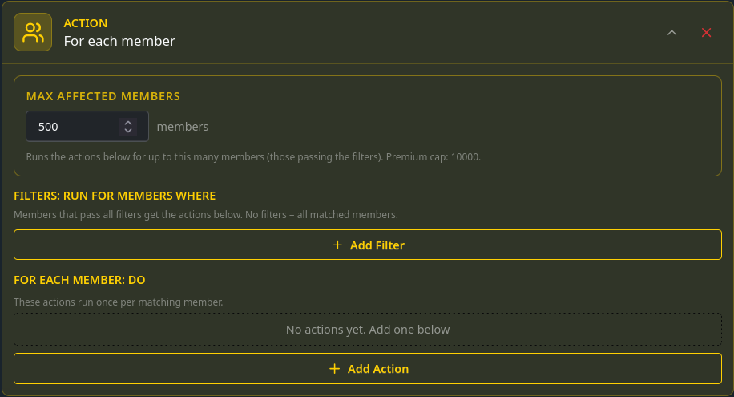

Mass actions refers to special type of action called **for each member**. It lets you run actions on multiple people at once based on criteria provided with conditionals. If the conditional is true for the member then run the defined actions. This makes it easy to run simple and complex operations like giving a role to everyone hence the name mass actions. 

:::danger
Leaving conditionals empty means it will apply to everyone.
:::

## Limits
**For each member action** is limited to affect 500 members and 10000 with premium

:::info
Due to abuse risk by default limits are strict. If you have use case where the limits are too low please get [in touch](https://monni.fyi/support) and we can increase them.
:::