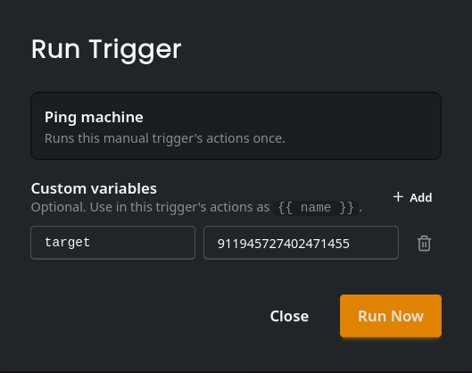

# Manual

Manual trigger is a trigger which only runs when you run it from the dashboard or the API. It can be useful for making manual one time actions like giving everyone in the server a role.

:::info
To learn more about running triggers via our API, visit our [API documentation](/developer/api/run-manual-trigger-v-1-automations-trigger-id-run-post).
:::
## custom context
Custom context allows you to pass your own context to the triggers. Currently custom data only supports flat values.

:::warning
Custom data will not show up in the context of the automation editor. It still is usable at the render time but ut isn't there during the configuration of the trigger.
:::