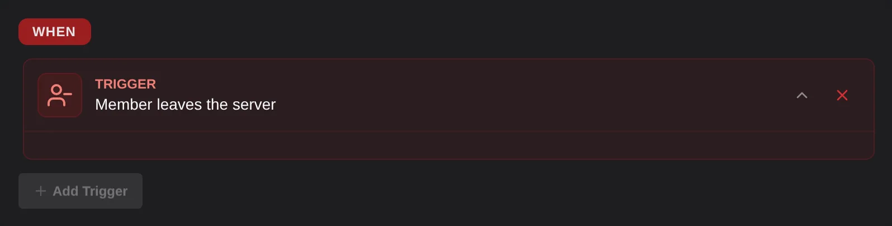

# Member left

The member left trigger runs every time someone leaves your server, whether they left on their own or were kicked or banned. Bots leaving don't trigger it.

## Options
This trigger has no options.

## Variables
- `{{member}}` | The member who left, like `{{member.name}}`.

:::warning
The member has already left when the trigger runs, so actions that change them, like giving roles, won't work. Sending messages and changing points still work.
:::
