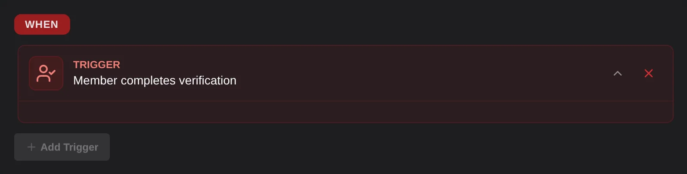

# Member verified

The member verified trigger runs when a member finishes verification with the [Verification module](/modules/verification). It runs once, when they become verified, even if they link more than one account.

## Options
This trigger has no options.

## Variables
- `{{member}}` | The member who verified.
- `{{account}}` | The account they verified with, like `{{account.name}}` or `{{account.id}}`.
- `{{roblox}}` and `{{minecraft}}` | Each linked account by platform, like `{{roblox.name}}`.

:::info
`{{account}}` is empty if your server only uses a captcha, or if the member was let in by a [passport](/modules/verification#passporting) from another server.
:::
