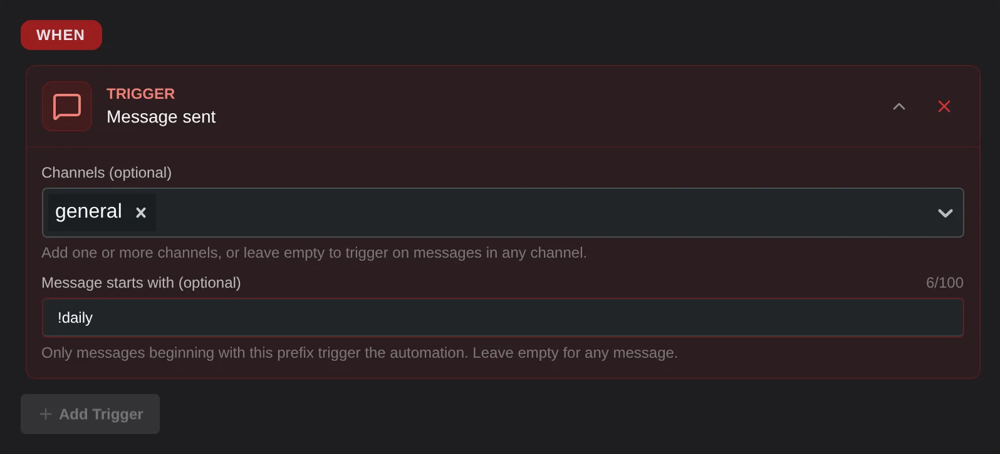

# Message sent
The message sent trigger runs any time a person sends a message.

## Options
### Channel
Limit the message trigger to one or more channels. Leave it empty to run on messages in any channel.
### Message starts with
Limit the message trigger to run only when a message starts with specified text. Useful for creating basic commands.