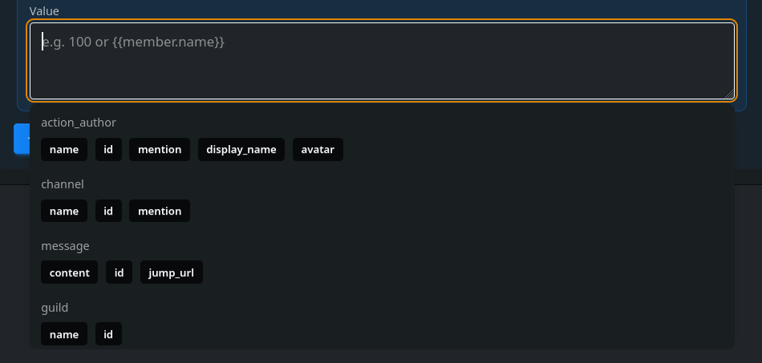

# Variables & templates
The action system and message systems within Monni are tightly coupled with a template library called [liquidjs](https://liquidjs.com/index.html). To fully understand how the system works, You'd be doing yourself a favour to read the below terms.

| **Term**                        | **Definition**                                                                                                  | **Example**                                             |
| ------------------------------- | --------------------------------------------------------------------------------------------------------------- | ------------------------------------------------------- |
| **Variable / Context**          | A value stored behind a specific identifier or key.                                                             | A variable named `name` storing the value `"monni"`.    |
| **Object / Variable / Context** | Placeholder which will be replaced with a provided variable.                                                    | `{{name}}` or `{{member.name}}`                         |
| **Tag**                         | Markup that controls the logic of the template (loops, conditionals, etc.). They do not output text themselves. | `` or ``   |
| **Filter**                      | A method used to modify the output of a variable or text.                                                       | `{{ "monni" \| capitalize }}` would capitalize Monni    |
| **Template**                    | Text with objects, tags and filters                                                                             | `Hello {{name}}!`                                       |
| **Rendered template**           | Templates which have been rendered.                                                                             | Before `Hello {{name}}!` after rendering `Hello monni!` |

## Variable substitution
Variable substitution/replacing objects is the simplest operation there is.

**Context**
>name -> Monni\
>server -> Fish heaven

**Template**
>```liquid
>Hello {{name}}, welcome to {{server}}.
>```

**Rendered template**
>Hello Monni, welcome to Fish heaven. 

In most cases variables are what we would usually refer to as objects. Objects are variables which have multiple values. An example of this could be a member who has a name and join date.

**Context**
>member -> `{name: "Monni", mention: "<@911945727402471455>", age: 20}`\
>server -> `{name: "Fish club", member_count: 252}`

**Template**
>```liquid
>Hello {{ member.mention }}, welcome to {{ server.name }}. You are member number {{ server.member_count | plus: 1 }}.
>```

**Rendered template**
>Hello Monni, welcome to Fish club. You are member number 253.
## Common Tags
### If condition
If conditions allow you to add paths to your template depending on if something is true or false. 

**Context**
>name -> Monni\
>bans -> 20

**Template**
>```liquid
>
>	{{name}} has no bans.
>
>	{{name}} has 1 ban.
>
>	{{name}} has {{bans}} bans.
>
>```

**Rendered template**
>Monni has 20 bans.

:::info
If your message has odd spacing, try adding dashes like in the provided example ``
:::
### For loop
Sometimes variables or objects can contain a list. In these cases being able to go over each element one at a time is useful.

**Context**
>members -> `[{name: "monni", cash: 2000}, {name: "dogfish", cash: -20}, {name: "trout", cash: 212}]`

**Template**
```liquid
Money Leaderboard

	{{ forloop.index }}. {{ member.name }}: {{ member.cash }}

```
**Rendered template**
> Money Leaderboard
> 1. monni: 2000
> 2. dogfish: -20
> 3. trout: 212


### Variable tag
Sometimes you may need to make your own variables. In the below example variables are used for sorting a list.

**Context**
>members -> `[{name: "monni", cash: 2000}, {name: "dogfish", cash: -20}, {name: "trout", cash: 212}]`

**Template**
```liquid

Money Leaderboard

	{{ forloop.index }}. {{ member.name }}: {{ member.cash }}

```

**Rendered template**
> Money Leaderboard
> 1. monni: 2000
> 2. trout: 212
> 3. dogfish: -20

:::info
You can find all of the supported tags and more in-depth information in [liquidjs docs](https://liquidjs.com/tags/overview.html)
:::

## Common filters
Filters edit the variable. This lets you do basic operations like appending text to variables or math. You can even hash the value.
**Context**
>number_1 -> 20\
>number_2 -> 20

**Template**
>```liquid
>numbers: {{number_1}}, {{number_2}}
>Plus: {{number_1 | plus: number_2 }}
>Minus: {{number_1 | minus: number_2 }}
>times: {{number_1 | times: number_2 }}
>```
**Rendered template**
>numbers: 20, 20\
>Plus: 40\
>Minus: 0\
>times: 400

:::info
You can find a full list in [liquidjs docs](https://liquidjs.com/filters/overview.html)
:::

## Liquidjs support
Most text fields in Monni are treated as templates, hence supporting liquidjs. A good rule of thumb is that if the context of a selector opens below the text box it supports liquidjs.




:::info
We limit the easy to abuse parts of template rendering heavily, such as loops and memory usage. If you run into issues relating to resource limits please [contact us](https://monni.fyi/support).  
:::