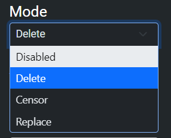

###### Module for anti-spam and filtering
***
The Auto Mod Module is designed to automatically protect your server.  
It contains Anti-Spam tools as well as a customizable chat filter.

### General Settings
---
These are the settings which affect how the Auto Mod tools work in your server:
Currently there are three settings you can edit.

1. **Log Channel**  
Activate this to send audit logs to a channel of your choice.

2. **Whitelisted Roles**  
Any roles you add here will be immune to Auto-Moderation tools.

3. **Whitelisted Channels**  
Channels you add will not be affected by Auto-Moderation tools.

### Chat Filter
---
The chat filter allows you to automatically detect blacklisted words and delete, censor, or replace them.

You can set your Chat Filter to different modes depending on what you want it to do.
- **DELETE** will cause Monni to delete messages once a blacklisted word is detected
- **CENSOR** will cause Monni to delete the blacklisted word and keep the rest
- **REPLACE** will cause Monni to replace blacklisted words with our safe alternatives
#### Other Options
---
- Whitelisted words are words ignored by the chat filter
	- If a slur were added, it could be said without consequence
- Blacklisted words are words the chat filter will detect
	- If a slur were added, it will no longer be allowed in messages
- Filtering level is how strict the filter will be
	- **LENIENT** will allow everything but extremely bad language, like racial slurs
	- **STANDARD** common slurs are moderated
	- **STRICT** nothing gets past
- Categories are offered that can be used to disable moderation of words in their respective field
	- Includes, **profanity, insults and slurs, NSFW, and offensive names.**

### Anti-Spam Tools
---
Our AutoMod Module contains a generous amount of Anti-Spam tools you can use to prevent spam.

See the list below for a description on each tool:
1. **Spam and Repeat Spam**
- The Spam tool allows you to punish members for spamming messages.
- When you want to use this tool you have to decide when you want to punish the member.
2. **Link Spam**
- The Link Spam tool allows you to punish members for spamming links.
- **WHITELIST MODE**  
All links will be detected by default. Any links you add to the list will be exempt from detection.
- **BLACKLIST MODE**  
Only links you add to the blacklist will be detected.
3. **Attachment Spam Tool**
- Detects messages containing attachments
4. **Mention Spam Tool**
- Detects messages containing mentions

To set the strictness of the spam filter:
- Set the amount of messages that must be sent for punishment
- Set the timeframe the messages must be sent in for punishment
### Punishment Actions
---
Actions are what you want Monni to do to when a member triggers a filter or spam tool.

Currently available actions are:
- **Verbal Warn** - Sends a condemnation message
- **Warn** - Warns the member
- **Mute** - Mutes the member
- **Timeout** - Times the member out
- **Kick** - Kicks the member
- **Ban** - Bans the member
- **Log** - Logs the event
