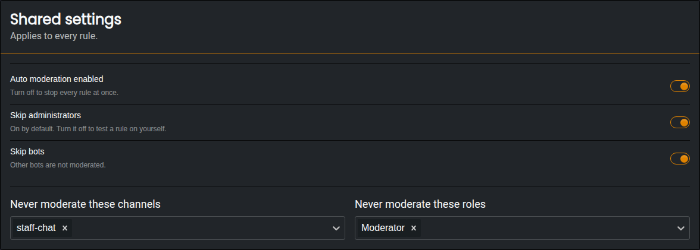
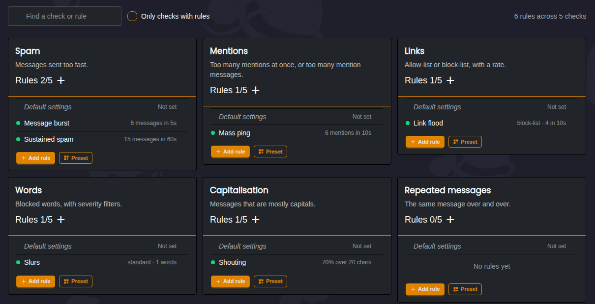
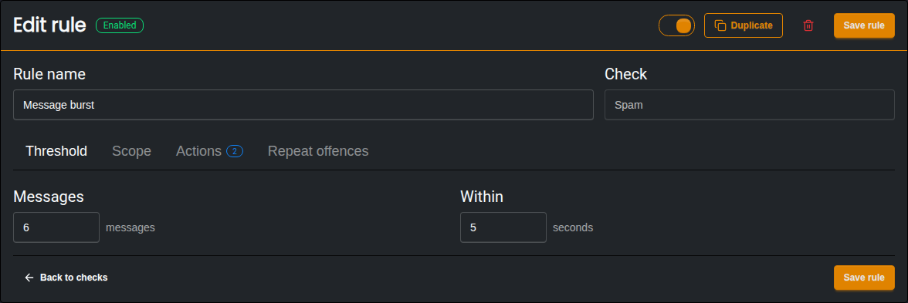
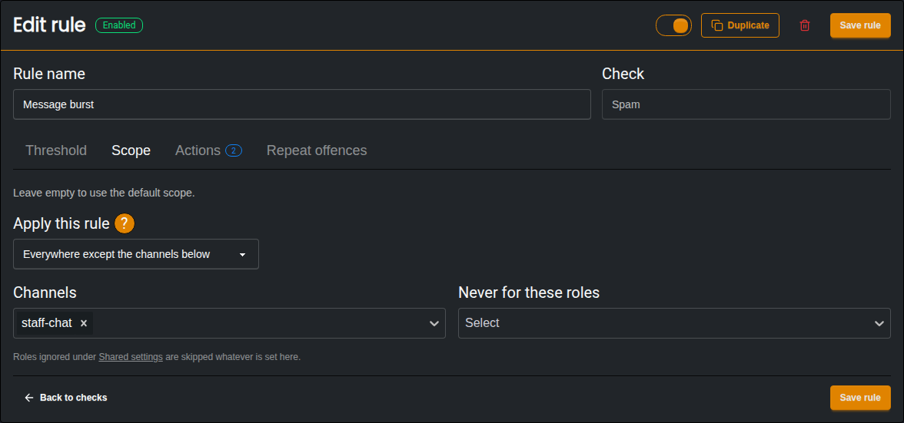
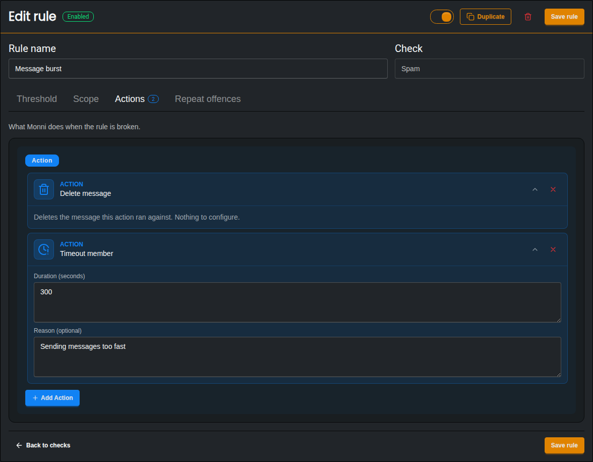
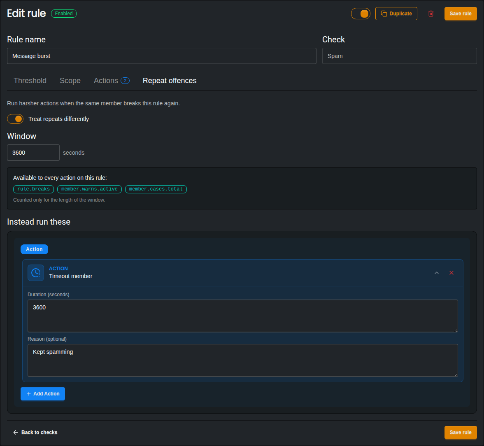
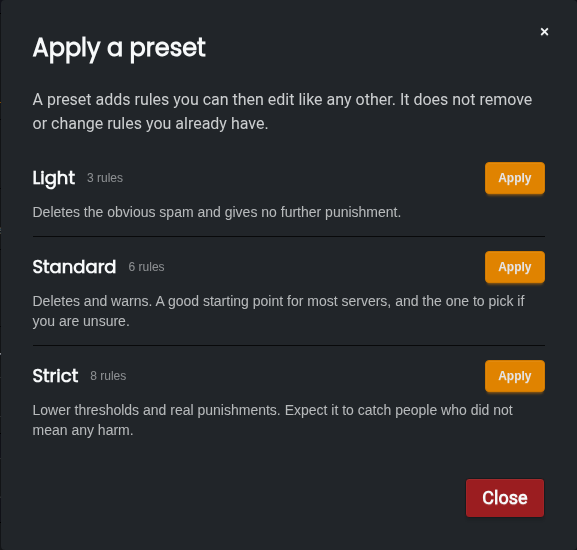
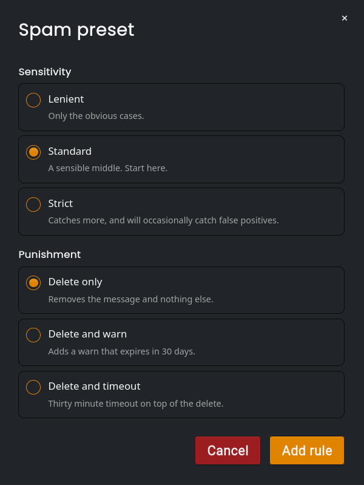

###### Module for anti-spam and chat filtering
***
The Auto Mod Module is designed to automatically protect your server. It checks every message for spam, blocked words and other unwanted content, and runs the actions you choose when a rule is broken.

Auto Mod is built from **checks** and **rules**. A check is something Monni looks for, like spam or mentions. A rule tells Monni how strict to be and what to do about it. Each check can have several rules, so you can, for example, delete a message burst straight away and time out someone who keeps spamming for a whole minute.

:::info
Free servers can have up to 5 rules per check. Premium servers can have up to 50.
:::

### Shared Settings
***
These settings apply to every rule.

- **Auto Moderation Enabled** | Turn this off to stop every rule at once.
- **Skip Administrators** | Members with the Administrator permission are ignored. Turn this off to test a rule on yourself.
- **Skip Bots** | Other bots are ignored.
- **Never Moderate These Channels** | Channels where Auto Mod does nothing.
- **Never Moderate These Roles** | Members with these roles are ignored by every rule.

### Checks
***
Each check shows how many rules it has, and a short summary of each one.

The available checks are:

- **Spam** | Messages sent too fast.
- **Repeated Messages** | The same message sent over and over.
- **Mentions** | Too many mentions in one message, or across several messages.
- **Attachments** | Too many files uploaded in a short time.
- **Links** | Too many links in a short time. Choose between blocking only the domains you list, or allowing only the domains you list.
- **Words** | Blocked words. See [Words](#words) below.
- **Channel Spam** | Messages sent to too many different channels in a short time.
- **Emoji** | Too many emoji in one message, or across several messages.
- **Long Messages** | Walls of text with too many lines.
- **Capitalisation** | Messages that are mostly capital letters. Short messages like "OK" are ignored.
- **Zalgo** | Messages full of stacked characters that make text unreadable.
- **Polls** | Too many polls in a short time.
- **Spoilers** | Too many spoiler tags in a short time.

Most checks are set as an amount within a number of seconds, like **6 messages within 5 seconds**.

#### Words
***
The Words check lets you block words from being used in your server.

- **On a Match** | Choose to **delete** the message, **censor** the word and keep the rest of the message, or **leave** the message and only run the rule's actions.
- **Strictness** | How hard Monni looks for the word.
	- **LENIENT** only matches the word exactly as written.
	- **STANDARD** also catches common workarounds, like numbers used in place of letters.
	- **STRICT** also catches the word inside other words and with repeated letters. This catches more, but may give more false positives.
- **Blocked Words** | The words Monni looks for.
- **Never Blocked** | Words that are always allowed, even if they match a blocked word. Useful for names that collide with the filter.

### Rules
***
Clicking a rule opens it in the rule editor. Each rule has four tabs.

#### Threshold
***
How strict the rule is. For most checks this is an amount and a number of seconds.

#### Scope
***
Where the rule applies. A rule can apply everywhere except some channels, or only in the channels you pick. You can also choose roles the rule should never apply to.

#### Actions
***
What Monni does when the rule is broken. Actions work the same way as in [**Automations**](/modules/automations/), so a rule can delete the message, warn or time out the member, give or take points, send a message and more.

:::warning
A rule without any actions does nothing, unless it is a Words rule set to delete or censor.
:::

#### Repeat Offences
***
Repeat Offences let you run harsher actions when the same member breaks a rule again. When turned on, Monni counts how many times a member breaks the rule within the **window** you set. From the second time onwards, the repeat actions are run instead of the normal ones.

Repeat actions can use these variables:
- `{{rule.breaks}}` | How many times the member has broken this rule within the window.
- `{{member.warns.active}}` | How many active warns the member has.
- `{{member.cases.total}}` | How many cases the member has in total.

### Default Settings
***
Each check has its own **Default settings**. The default scope always applies on top of each rule's own scope. The default actions and repeat actions are used by any rule in that check that doesn't have its own.

### Presets
***
Presets are a quick way to get started. A preset adds rules you can then edit like any other. It doesn't remove or change rules you already have.

- **Light** | Deletes the obvious spam and gives no further punishment.
- **Standard** | Deletes and warns. A good starting point for most servers.
- **Strict** | Lower thresholds and real punishments. Expect it to catch people who didn't mean any harm.

Each check also has its own **Preset** button, which lets you pick how sensitive the rule should be and how it should punish.

### Additional Information
***

- **Punishments given by Auto Mod are saved as cases in the [*Moderation Module*](/modules/moderation).**

- **To stop bots and hacked accounts posting across your whole server, see the [*Anti Bot Module*](/modules/anti-bot).**
