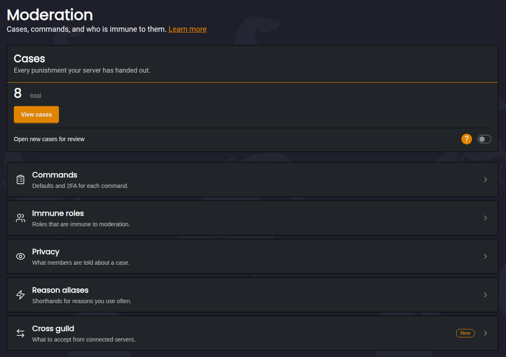
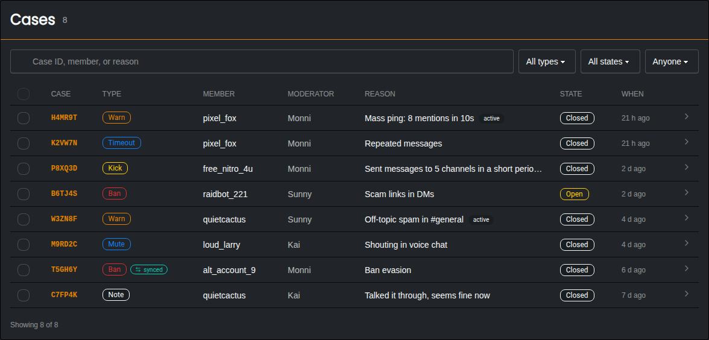
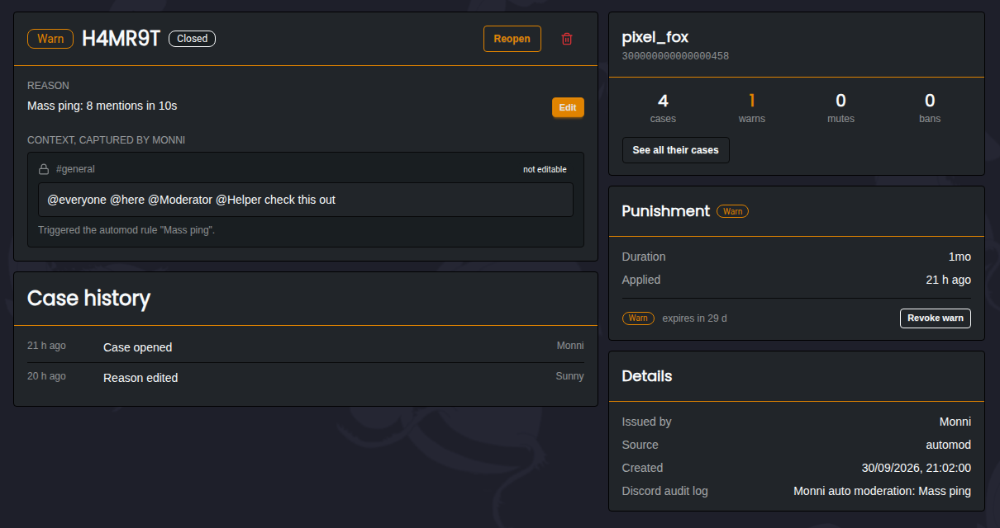
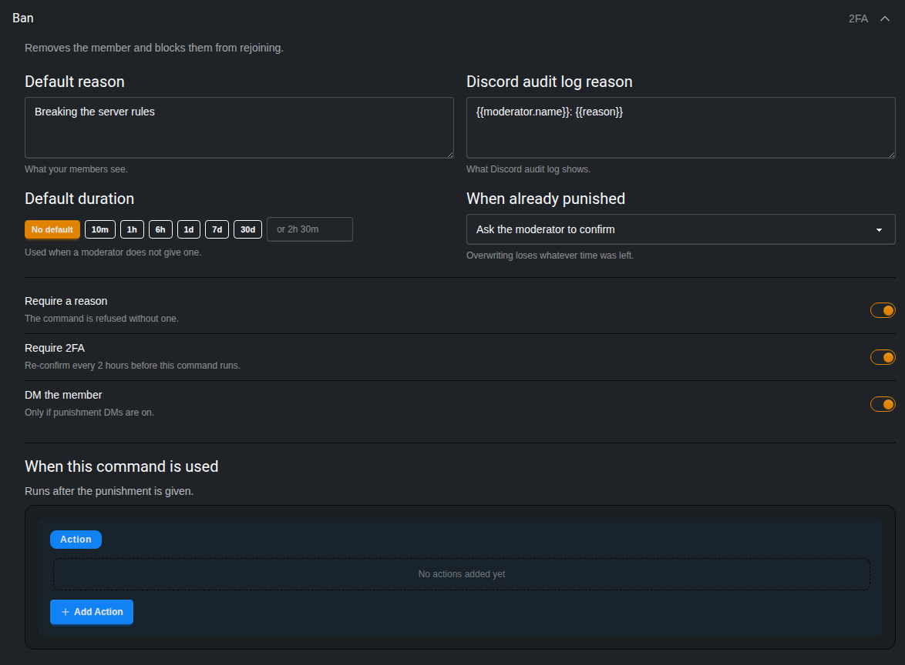
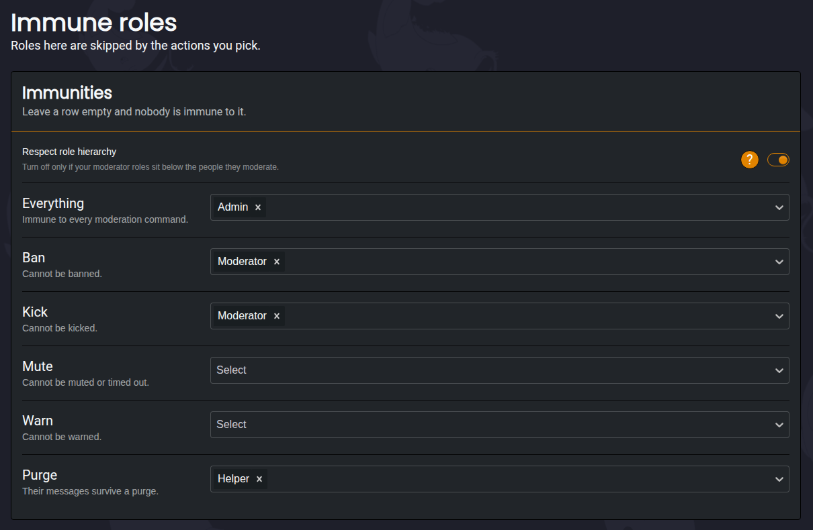
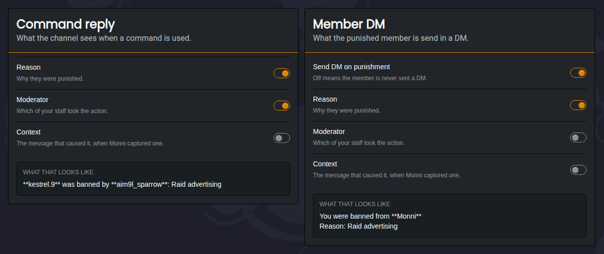
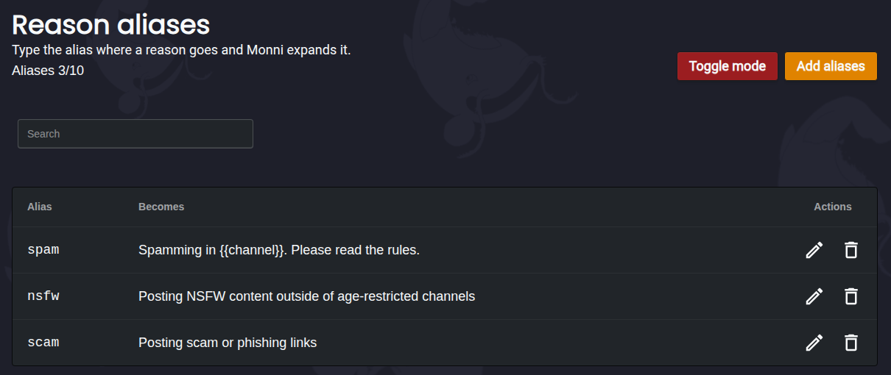
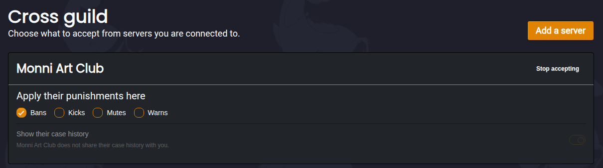

###### Module for punishing rulebreakers
***
The Moderation Module is designed to keep members from breaking the rules. It comes with commands to ban, kick, mute, time out and warn members, and a purge command for clearing spam out of a channel. Every punishment is saved as a **case**, so you always have a record of who did what and why.

:::info
**All available commands for this module can be found [*here*](/commands/slash/moderation/moderation-commands).**
:::

### Cases
***
Every punishment creates a case, whether it was given by a moderator, the [**Auto Mod Module**](/modules/automod), the [**Anti Bot Module**](/modules/anti-bot), an [**Automation**](/modules/automations/) or a connected server. Each case gets a short ID like `H4MR9T`, which you can use in commands to find or edit it.

You can search cases by case ID, member or reason, and filter them by type, state and who gave the punishment. Cases from a connected server are marked as **synced**.

#### Case Page
***
Opening a case shows everything about it.

- **Reason** | Can be edited at any time. You can choose to let the member know the reason changed.
- **Context** | The message that caused the punishment, captured by Monni when it happened. This can't be edited.
- **Case History** | Everything that has happened to the case, like reason edits and state changes.
- **Member Summary** | How many cases, warns, mutes and bans the member has in total.
- **Punishment** | How long the punishment lasts, and when a warn expires. Warns can be revoked from here.

#### Reviewing Cases
***
Cases can be **Open** or **Closed**. Turn on **Open new cases for review** on the Moderation page and every new case starts as open, until a moderator closes it. This is useful if your staff team double checks each other's punishments.

### Warns
***
Warns are used to keep track of a member's offences so you can better decide their punishment. Each warn can have its own expiry, after which it stops counting towards the member's active warns. Expired and revoked warns are still kept in the member's case history.

### Command Settings
***
Each command can be configured separately under **Commands**.

- **Default Reason** | The reason used when a moderator doesn't give one.
- **Discord Audit Log Reason** | What is shown in Discord's audit log. This is kept separate so the audit log can show which moderator used the command.
- **Default Duration** | How long the punishment lasts when a moderator doesn't give a duration. With no default, bans and mutes last until they are removed.
- **When Already Punished** | What happens if the member is already banned, muted or timed out. Monni can ask the moderator to confirm, always replace the old punishment, or refuse. Replacing a punishment loses whatever time was left on the old one.
- **Require a Reason** | The command is refused if no reason is given.
- **Require 2FA** | Moderators need to confirm with Two-Factor Authentication every 2 hours to use the command. Not recommended for smaller servers, but very helpful for large servers that are vulnerable to Moderator accounts being hacked.
- **DM the Member** | Sends the member a direct message about the punishment. This only works if **Send DM on punishment** is turned on under [Privacy](#privacy).
- **When This Command Is Used** | Actions that run after the punishment is given, such as giving a role or sending a message. These work the same way as [**Automation**](/modules/automations/) actions.

Reasons support variables like `{{member.name}}` and `{{moderator.name}}`. The available variables are shown when editing a reason.

#### Mute Type
***
The Mute command can mute members in three different ways:

- **Timeout** | Uses Discord's built in timeout. This is the default.
- **Mute Role** | Gives the member a mute role. You can pick the role, or let Monni create one called **Muted**.
- **Hard Mute** | Removes all of the member's roles and gives them the mute role. Their roles are given back once the mute ends.

:::warning
Make sure the Monni role is above the mute role and any roles you want Hard Mute to remove, or Monni won't be able to manage them!
:::

- **Sticky Mute** | Only for Mute Role and Hard Mute. If a muted member leaves and rejoins, they will be muted again.

#### Timeouts Longer Than 28 Days
***
Discord doesn't allow timeouts longer than 28 days. With **Extend past 28 days** turned on, Monni keeps re-applying the timeout until the full duration is served. With it turned off, timeouts are capped at 28 days.

Removing the timeout with Monni, or from Discord directly, stops it from being re-applied.

### Immune Roles
***
Immune roles let you protect members from moderation commands. You can make a role immune to everything, or only to certain actions, like bans or purges.

- **Respect Role Hierarchy** | A moderator can't punish someone whose highest role is the same as or above their own. The server owner can always punish anyone.

:::info
Immune roles only apply to moderation commands. To stop the Auto Mod Module from acting on a role, add it under **Shared settings** in the [**Auto Mod Module**](/modules/automod).
:::

### Privacy
***
Privacy lets you choose what Monni shows when someone is punished.

- **Command Reply** | What the channel sees when a command is used. You can choose whether it shows the reason, the moderator, and the message that caused the punishment.
- **Member DM** | What the punished member is told in a direct message. **Send DM on punishment** turns these messages on or off for every command. You can then choose whether the DM shows the reason, the moderator, and the message that caused the punishment.

### Reason Aliases
***
Reason aliases are shorthands for reasons you use often. If you add an alias called `spam`, typing `spam` as the reason will use the full reason instead.

### Cross Guild
***
If your server is connected to other servers through [**Cross Guild**](/cross-guild/), you can choose which of their punishments should also apply in your server.

- **Apply Their Punishments Here** | Choose whether their bans, kicks, mutes and warns are also applied in your server. These show up in your cases as **synced**.
- **Show Their Case History** | Lets you see their cases for a member, if they have chosen to share them.

:::info
Your own immune roles still apply to punishments from a connected server.
:::

### Additional Information
***

- **All moderation commands can be logged in a channel of your choice using the [*Logging Module*](/modules/logging/).**

- **All available commands relating to the Moderation Module can be found [*here*](/commands/slash/moderation/moderation-commands).**
