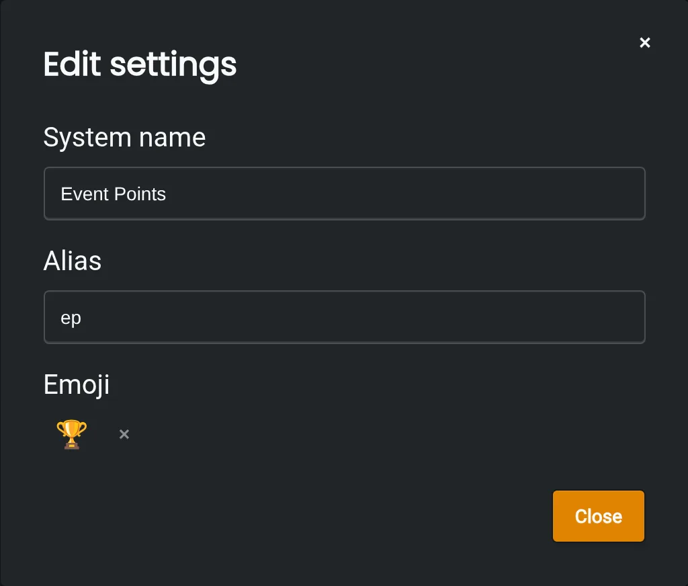

### What are they?
---
Point systems are where the points themselves are stored. Each system has a custom ID, which then has members and point amounts associated with it. One example would be participation points, where the number of events or game nights a member joins is represented by the number of points they have in the system.

### Creating and customizing a system
---
A system can be created by going to the dashboard, going to the `Systems` section of the `Points` Module, and then pressing "Add systems".

Each system has a name, alias, and emoji associated with it:

1. The name of a system is what the system goes by inside the dashboard.
2. The alias is what the system goes by when referred to in [commands](/modules/points/commands) like [/balance](/commands/slash/points/balance) when mentioned within a Discord server.
3. The emoji is referred to in the same way as the alias within a Discord server.

### Limits
---
To prevent Discord servers from overusing Monni's resources, there are restrictions to the number of systems which can exist in a single server.

This limit is 10 systems for a normal server. Limits can be increased indefinitely through our premium subscription.