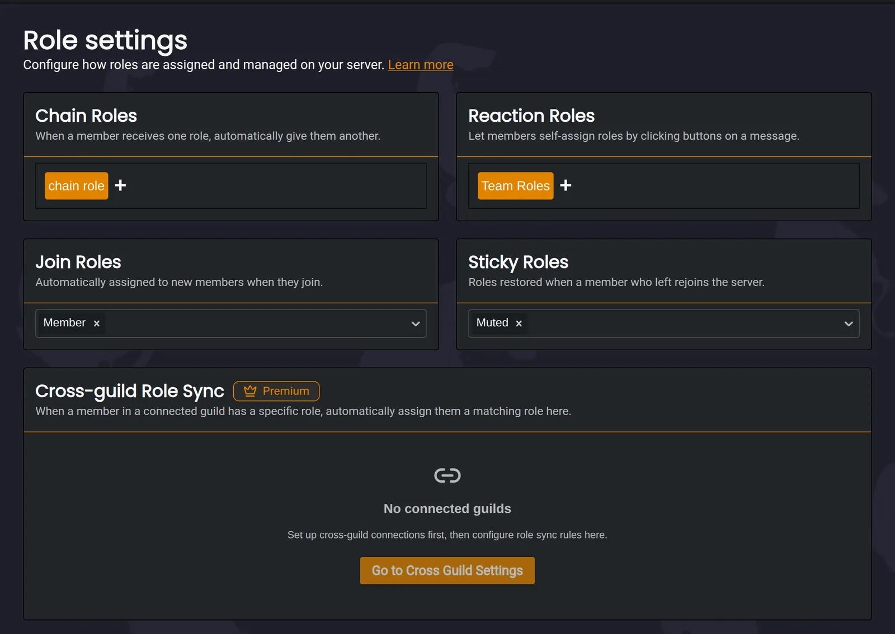
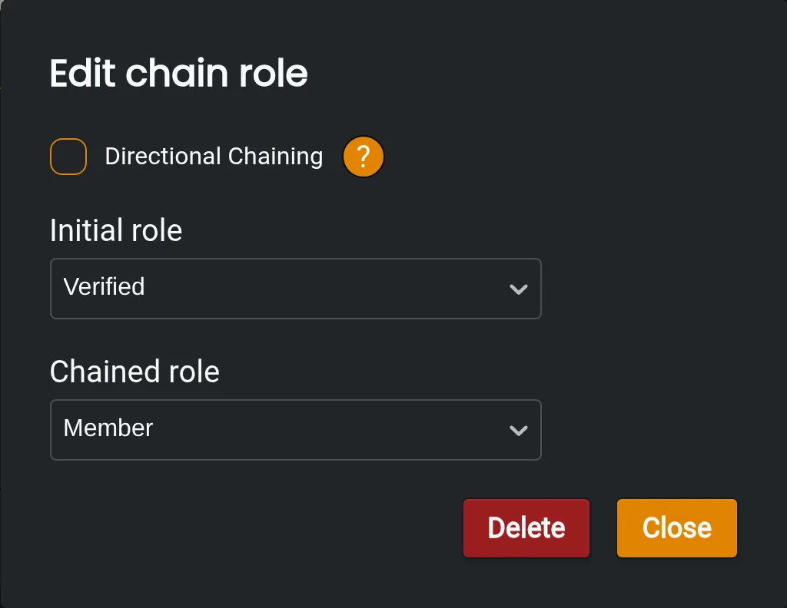
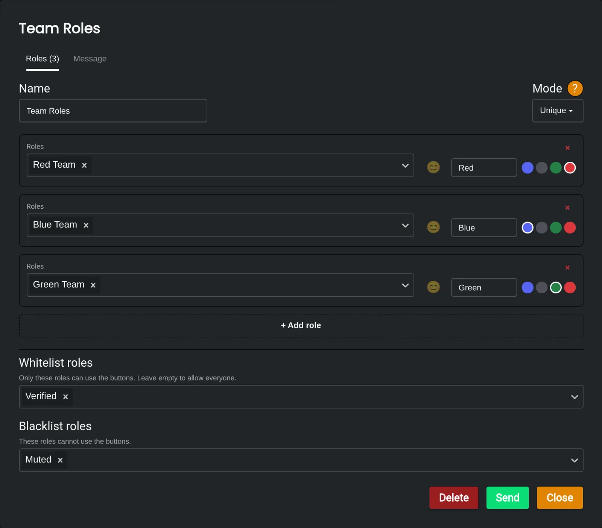
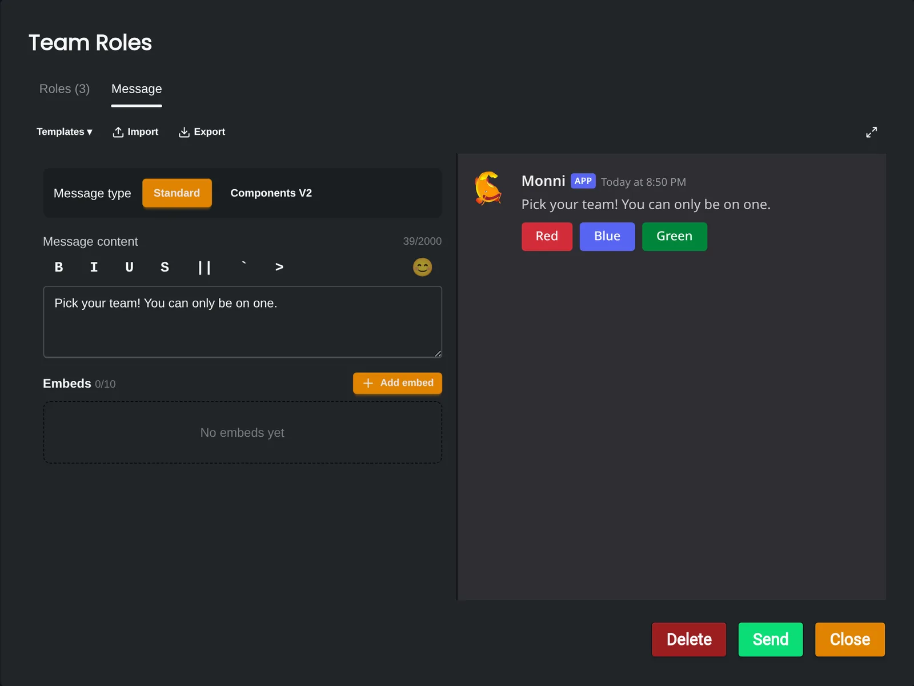

###### Module for managing member roles
***
The Roles module gives members roles automatically, so you don't have to do it by hand. It has five tools: join roles, sticky roles, chain roles, reaction roles and cross-guild role sync.

:::info
Monni can only give and take roles that are below its own role. Read [Monni Role Position](/guides/monni-role-position) if roles aren't being given.
:::

### Join Roles
***
Join roles are given to every member when they join your server. You can pick as many as you like.

### Sticky Roles
***
Sticky roles are given back to members who leave and rejoin, if they had the role when they left. This stops members from losing a role, or escaping a role like **Muted**, by leaving and joining again.

### Chain Roles
***
Chain roles give a member a second role when they get the first one.

- **Initial role** | The role that starts the chain.
- **Chained role** | The role given when a member gets the initial role. Losing the initial role also removes the chained role.
- **Directional chaining** | When turned on, the chain works both ways. Getting either role gives both, and losing either role removes both.

### Reaction Roles
***
Reaction roles post a message with buttons. Members press a button to give themselves a role, or press it again to remove it. Each set of buttons is set up in its own editor.

- **Name** | Only shown in the dashboard, to tell your sets apart.
- **Buttons** | Up to 5 buttons per message. Each button has a label, an optional emoji, a color, and one or more roles it gives.
- **Whitelist roles** | Only members with one of these roles can use the buttons. Leave it empty to let everyone use them.
- **Blacklist roles** | Members with one of these roles can't use the buttons.

#### Modes
***
The mode decides what happens when a member presses a button.

- **Normal** | Gives the button's roles, or removes them if the member already has them.
- **Unique** | A member can only have one role from the set. Picking a new one removes the old one.
- **Give only** | Buttons only give roles. Pressing a button for a role you already have does nothing.
- **Remove only** | Buttons only remove roles. Pressing a button for a role you don't have does nothing.
- **Limit** | A member can have up to a set number of roles from the set. Pressing a button for a role they already have removes it. If they are at the limit, Monni tells them to remove one first.

#### The Message
***
The **Message** tab lets you write the message the buttons are posted under, using the [Message Builder](/misc/tools/message-builder). You can use a plain message, embeds or Components V2, and see a live preview while you write.

When you're done, press **Send** and pick a channel. To change a message you already sent, paste its message link under **Update existing message** and Monni edits it instead of posting a new one.

### Cross-guild Role Sync
***
Cross-guild role sync gives members a role in your server when they have a role in a server you are connected to. For example, members with **Staff** in your main server can get **Staff** in your second server automatically.

You need a [Cross Guild](/cross-guild/) connection with the `read_roles` permission first. This is a premium feature.

### Additional Information
***

- **A step by step guide for reaction roles can be found [*here*](/guides/reaction-roles).**
