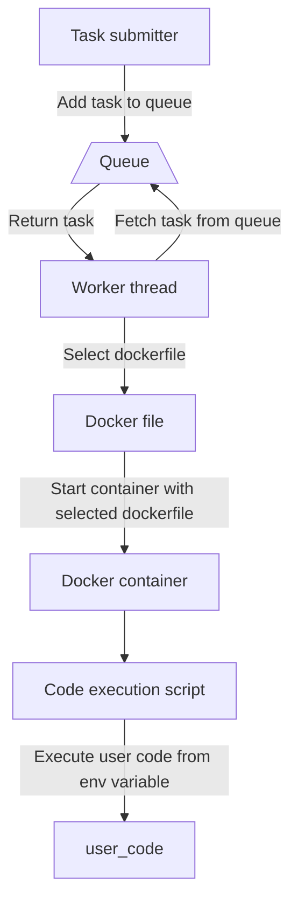

# Simpukka
Simpukka is the sandboxed runtime environment used to execute all your triggers and custom code. This page provides broad overview of simpukka and how it works internally

:::warning
Simpukka doesn't guarantee code is executed instantly or at all. Following limitation is explained better below
:::

## How does simpukka work?
Simpukka sandbox is based on docker. In short first correct dockerfile is started then runner script gets user code from enviriomental variable and executes the code. Below is a flowchart which goes into bit more detail. Due to the queue based nature of the code execution if there are a lot of tasks waiting to be executed the task giver may not be alive anymore when the tasks gets executed

## Terminology

### Group
Groups are way to store information about where task came from and to ensure a single source of tasks can't eat up all the execution resources. In most cases there are two different groups. Users and guilds.
### Queue
Queue used is persistent and keeps record of completed tasks up to two 2 weeks. The queue system prioritizes tasks marked high priority and tasks coming from premium guilds. Users cannot affect the priority of their own tasks as it's determined by Monni. By default, triggers are medium priority. Each group can have up two tasks being executed at once if group has premium this limit is increased to four. 

## Callbacks
Callbacks are the mechanism which simpukka task submitter can communicate with the task after the submitting. Following callbacks exist
- Task completed
- Task started
- Task ran into error while execution
- Task input
### Simpukka API
Simpukka API is the gateway to communicating with discord and the host system. Url for simpukka API is `http://host.docker.internal:5000`. The docker container is provided with randomly generated unique identifier. This is used to authenticate the requests and determine where from a request is coming from and where it should have access to, The API server only accepts HTTP protocol. The identifier should be sent in JSON in following manner `{"identifier": randomly_generated_identifier}`. Everything in simpukka API is received and sent as json. Simpukka API is only needed if the runtime doesn't provide a wrapper over it. 

## Resource limits and tracking
Execution sandboxed code isn't free hence we have limits in place to ensure everybody can execute their code and to ensure any sort of abuse won't be able to go on forever. Limits are in form of storage, compute seconds and network traffic.

### Storage
The space you are given to store data in persistent format.

#### Compute seconds
Compute seconds are how resource usage is calculated. The formula for compute seconds is `cpu seconds * (ram usage / 32mb)`. Each container usually uses around 32mb of ram not including the language runtime. Depending on the weight of the language the ram usage can be higher. CPU seconds are the amount of time that CPU has been used. We track this in nanoseconds which is then converted to seconds and rounded with reasonable accuracy in your favor. By tracking ram usage and CPU usage time we ensure that you are only limited by resources you really use and not just time the code execution took.

#### Network traffic
Inbound and outbound network traffic. Includes traffic to simpukka api.
### Limits
#### Guild limits
 - 30 minutes of compute seconds.
 - 1 GB of network traffic
 - 250 Kb of storage

#### User limits
 - 30 minutes of compute seconds.
 - 250 MB of network traffic
 - 100 Kb of storage

## Execution context
Context provides information about the execution like in the case of message sent trigger where in the context there is the message author id, message id and other related information. If you're dealing with the raw API it's your responsibility to fetch the information you need from the API.
## Sandboxing mechanism
Simpukka uses docker and gvisor as its main mechanism of sandboxing. The resources of the docker container is limited to stop abuse