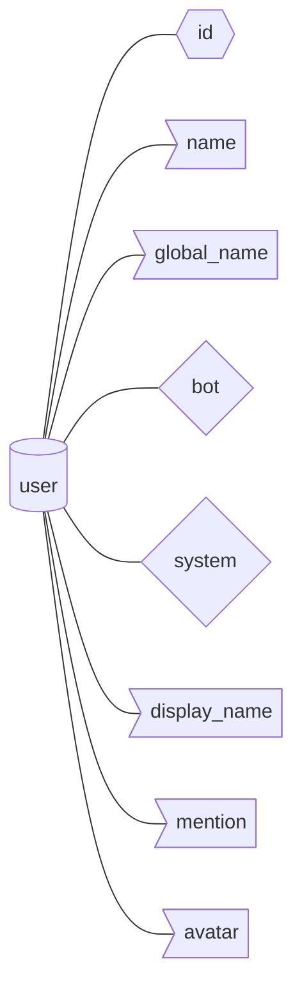

Common information of a discord user.

## Structure

## Documentation

### id - int
Id of the user.

### name - str
Name of the user.

### global_name - str
Global username. One unique to your account.

### bot - bool
Whether a user is a bot or not.

### system - bool
Whether a user is a system or not.
### avatar - str
Url to users avatar.
### mention - str
Mention string for mentioning the user.

