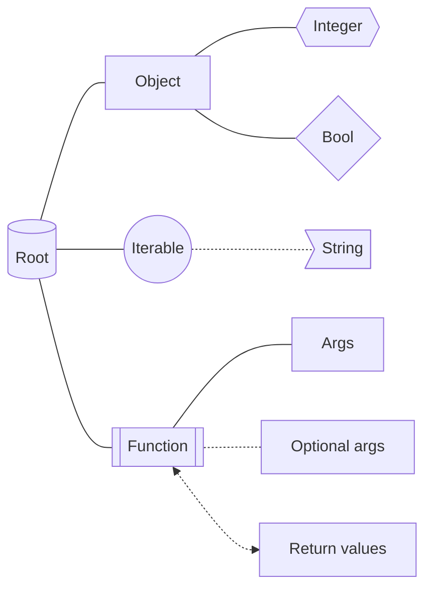

Objects are the data and functions related to some external data and actions. They provide a convenient abstraction over raw data and third party actions such as discord communication.

:::warning
Data objects may vary slightly between wrappers. Some may not implement all of them or may have them only partially implemented. Please refer to languages own page for information on what is exists and what's missing.
:::

## Object visualization
Each object can be visualized in a graph. Each graph consists of name of the object (root), objects (subtrees) and variables or functions (leafs). Functions and variables can have extra leafs to provide more information like arguments or return value. Different lines and shapes convey the type of the value.

